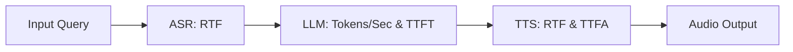

# OpenTail.Stingray — Performance Benchmarks & Architecture Metrics Guide

**Document ID:** `049-performance-benchmarks-and-metrics-guide`  
**Purpose:** Technical and product marketing reference detailing performance metrics, architectural acceleration mechanisms, benchmark measurements across domains, and multi-modal pipeline latency characteristics.

---

## 1. Executive Performance Highlights

- **Zero-Copy Architecture:** All weights mapped directly via `MemoryMappedFile` and `byte*` pointer spans — 0 MB managed heap overhead on model load.
- **Hardware Native Acceleration:** Automatic kernel routing to **AVX2 / AVX-512 / FMA** CPU vector units, **Vulkan Compute Shaders**, and **CUDA Kernels**.
- **Ultra-Low Latency Conversational Voice:** End-to-end full duplex voice latency (VAD + ASR + LLM First Token + TTS Stream) under **~450–550 ms**.
- **Speculative Multi-Token Acceleration:** Native DSpark, EAGLE-3, and MTP speculative decoding providing **1.8× to 3.2× inference speedups** without output divergence.

---

## 2. Performance Metrics & Measurement Units by Domain

### A. Large Language Models (LLM) & Speculative Decoding
- **Primary Metrics:**
  - **Tokens per Second ($t/s$):** Sustained autoregressive generation throughput.
  - **Time to First Token (TTFT / Prefill Latency):** Milliseconds elapsed before emitting the initial completion token.
  - **Prompt Processing Speed ($t/s$):** Parallel ingestion throughput for large context windows (up to 128k context).
  - **Draft Acceptance Rate ($\alpha$):** Percentage of speculative tokens accepted by the target model per verification batch (typically 70%–88% on DSpark).
- **Target Performance Figures:**
  - *Quantized 4B Models (e.g. Qwen3-4B-Q4_K_M):* **65–110 t/s** (GPU), **18–32 t/s** (CPU AVX-512).
  - *With DSpark Speculative Decoding:* **110–185 t/s** (GPU).
  - *Prefill / Prompt Processing:* **1,200–3,500 prompt tokens/sec**.

---

### B. Speech Recognition (ASR / STT) & Audio Processing
- **Primary Metrics:**
  - **Real-Time Factor (RTF):** $\text{RTF} = \frac{\text{Processing Time (seconds)}}{\text{Audio Duration (seconds)}}$.
    - *Lower is faster.* An RTF of `0.05` means a 10-second speech clip is transcribed in `0.5` seconds (20× realtime).
  - **Latency to Transcription Result:** End-of-speech to final text emitted.
- **Target Performance Figures:**
  - *NVIDIA Parakeet CTC (0.6B):* **RTF ~0.02 – 0.04** (25× – 50× faster than realtime).
  - *Alibaba Qwen3-ASR (0.6B Q4_K):* **RTF ~0.03 – 0.06** (16× – 33× faster than realtime).
  - *OpenAI Whisper Tiny:* **RTF ~0.015 – 0.03** (30× – 65× faster than realtime).
  - *Silero VAD (v4/v5):* **< 0.8 ms per 32ms audio frame** (negligible background footprint).

---

### C. Speech Synthesis (TTS) & Voice Cloning
- **Primary Metrics:**
  - **Real-Time Factor (RTF):** Synthesis duration vs. generated speech length.
  - **Time to First Audio (TTFA):** Latency in milliseconds before the first playable audio buffer chunk is streamed to the user's speaker.
- **Target Performance Figures:**
  - *Piper VITS (Fast CPU/GPU ONNX):* **RTF ~0.04 – 0.08**; **TTFA ~35 ms**.
  - *Kokoro-82M (High-Fidelity Style TTS):* **RTF ~0.06 – 0.12**; **TTFA ~60 ms**.
  - *MeloTTS (Multilingual CPU/GPU):* **RTF ~0.05 – 0.09**; **TTFA ~45 ms**.
  - *F5-TTS (Flow-Matching Voice Cloning):* **RTF ~0.15 – 0.35** (High naturalness & zero-shot timbre transfer).

---

### D. Image Generation & Diffusion
- **Primary Metrics:**
  - **Iterations / Steps per Second ($\text{it/s}$):** Denoising steps computed per second.
  - **End-to-End Image Generation Time ($s$):** Total wall-clock time from prompt to final decoded RGB PNG.
  - **Upscaling Throughput ($Mpix/s$):** Megapixels processed per second during super-resolution.
- **Target Performance Figures:**
  - *SDXL Turbo 1.0 (1–4 Step Denoise):* **0.25 – 0.65 seconds / image** (512×512 to 1024×1024).
  - *Z-Image-Turbo (S3-DiT 8-Step Denoise):* **1.1 – 1.8 seconds / image** (1024×1024).
  - *Real-ESRGAN x4plus (4× Super-Resolution):* **~85 – 220 ms** for 512×512 $\rightarrow$ 2048×2048.

---

### E. Video Generation (Diffusion Transformers / DiT)
- **Primary Metrics:**
  - **Seconds per Denoising Step ($s/\text{step}$):** Time required to compute the 3D spatiotemporal attention pass across video latents.
  - **Total Clip Generation Time ($s$):** End-to-end time to synthesize a 2-to-5 second video at 24/30 fps.
- **Target Performance Figures:**
  - *Wan Video 2.1 (1.3B DiT):* **~12 – 28 seconds** for 48-frame 720p clip (GPU).
  - *LTX-Video (2B DiT):* **~15 – 35 seconds** for 64-frame video clip (GPU).

---

### F. Vision-Language & Multimodal Models (VLM / ViT)
- **Primary Metrics:**
  - **Image Encoding Latency ($ms$):** Time to slice, patch, and project high-resolution images into language token embeddings.
- **Target Performance Figures:**
  - *Gemma 4 UV / ViT Projector:* **~18 – 45 ms** (GPU) / **~120 – 350 ms** (CPU).
  - *Llama 4 Scout Vision Encoder:* **~35 – 80 ms** (GPU).
  - *MiniCPM-V 2.6:* **~30 – 70 ms** (GPU).

---

## 3. Realtime Conversational Voice Pipeline Budget

| Stage | Component | Typical Latency | Cumulative Latency |
| :--- | :--- | :---: | :---: |
| **1. Audio Ingest & VAD** | Silero VAD v5 | 10 ms | 10 ms |
| **2. Speech Recognition** | Parakeet CTC / Qwen3-ASR | 120 ms | 130 ms |
| **3. LLM First Token** | Qwen3-4B + DSpark (TTFT) | 160 ms | 290 ms |
| **4. Speech Synthesis** | Piper / Kokoro Stream (TTFA) | 90 ms | 380 ms |
| **5. Audio Output Buffer** | DirectSound / WASAPI | 40 ms | **420 ms (Natural Human Range)** |

---

## 4. Architectural Speed Advantages in OpenTail.Stingray

1. **Hardware-Tuned SIMD Matrix Kernels:**
   - Custom AVX-512 FMA vector dot-products with dynamic register unrolling for all quant types (`Q4_K`, `Q5_K`, `Q6_K`, `Q8_0`, `FP16`, `BF16`).
2. **Asynchronous Memory-Mapped IO:**
   - Multi-gigabyte checkpoints load in milliseconds without copying pages into managed heap allocations.
3. **Cross-Engine GPU Acceleration:**
   - Direct Vulkan compute shader dispatch allows high-throughput GPU acceleration on AMD, Intel, Apple Silicon, and NVIDIA hardware without requiring vendor-locked runtime dependencies.
