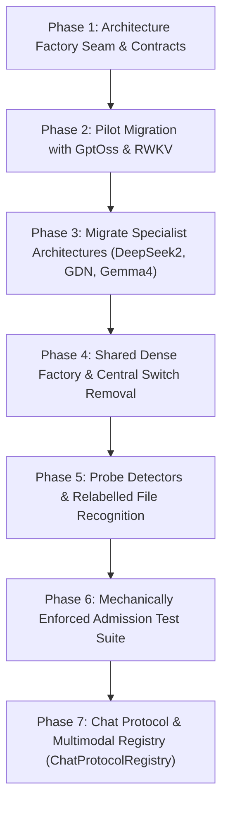

# Architecture Plugin & Admission Refactor: Implementation Plan (2026-10-06)

**Reference & Origin:** Adapted from TensorSharp's descriptor-driven model admission architecture (`TensorSharp.Models.Architecture.ModelArchitectureDescriptor` + `ModelArchitectureRegistry`, BSD-3; located at `examples/TensorSharp/TensorSharp/`) for OpenTail.Stingray.

---

## 1. Executive Summary & Problem Statement

### 1.1 The Current Problem in Stingray
Stingray recently consolidated model family admission and forward-pass policy selection into:
1. `ArchitectureDescriptor` + `ArchitectureRegistry` + `BuiltInArchitectures`: Defines admission status (`Admitted`, `NotAdmitted`, `Experimental`), evidence documentation links, refusal reasons, and static metadata.
2. `ForwardPassSelection`: Evaluates selection policy (CPU/CUDA/Vulkan, TurboQuant constraints, batching rules, VRAM limits) and returns a `ForwardPassDecision` with a `ForwardPassKind`.

However, the **actual knowledge of how to construct a model family's runtime implementation** is still trapped in central switches and duplicated across frontends:
- `ModelContext.BuildForwardPass(...)` contains a 14-case `switch (kind)` (`SafeTensorsCpu`, `CpuDense`, `CpuHybridGdn`, `RwkvCpu`, `GptOssCpu`, `GptOssVulkan`, `DeepSeek2Vulkan`, `CudaDense`, `CudaHybridGdn`, `CudaHybrid`, `VulkanDense`, `VulkanHybridGdn`, `VulkanHybrid`, `VulkanLayerSplit`).
- `InferenceEngineLoader.cs` in `OpenTail.Stingray.Server` has parallel conditional branches (lines 590–860) instantiating forward passes with bespoke hardware and backend logic.
- `RunCommand.cs` in `OpenTail.Stingray.Cli` has its own backend and forward-pass instantiation logic (lines 800–1600).
- Frontends still perform ad-hoc checks on architecture names:
  - `ModelGraph.cs`: checks `arch == "jais2"`, `arch == "nemotron_h"`, `arch == "granitehybrid"`, `arch == "cohere2"`, `arch == "olmo"`, `arch == "glm4moe"`.
  - `PrefillHandoffFamilies.cs`: checks `arch == "llama" && Int(metadata, "llama.expert_count") > 0 ? "llama+experts" : arch`.
  - `UnifiedVisionPipeline.cs`: has 20+ sequential `if (arch == "...")` branches when opening companion vision models.
  - `ChatTemplate.cs`: checks `arch == "gemma4"` for thinking defaults and `FallbackChatFormat`.

When adding a new model family today, a developer must touch:
1. `ModelHyperparams.cs`
2. `ModelGraph.cs`
3. `ArchitectureDescriptor.cs`
4. `ArchitectureRegistry.cs`
5. `BuiltInArchitectures.cs`
6. `ForwardPassSelection.cs`
7. `ModelContext.cs`
8. `InferenceEngineLoader.cs`
9. `RunCommand.cs`
10. `ChatTemplate.cs`
11. `UnifiedVisionPipeline.cs`

### 1.2 The TensorSharp Solution
TensorSharp eliminated central model factories by making each model family **own its own descriptor**:
- A family lives in its own directory (e.g. `Models/Qwen35/` or `Models/GptOss/`).
- The family class exposes a static `Descriptor` property declaring its canonical id, aliases, tensor detectors, factory delegate (`Factory`), and hardware placement rules.
- `ModelArchitectureRegistry` resolves the descriptor from the GGUF metadata or tensor probes.
- `ModelBase.Create()` invokes `descriptor.Factory(createContext)` without knowing which family it is running.
- Adding a model family requires editing **only two places**: the model's own directory and **one line** in `BuiltInArchitectures.cs`.

### 1.3 Stingray's Evolutionary Advantage
Stingray does not need to discard its existing architecture work. In fact, Stingray achieves a superior design by cleanly separating **selection policy** from **model construction**:

```text
Model File (GGUF / SafeTensors)
   ↓
ArchitectureProber.Probe(...)                  ──►  ArchitectureProbe (read-mostly tensor/metadata view)
   ↓
ArchitectureRegistry.Resolve(...)              ──►  ArchitectureDescriptor (family identity & capabilities)
   ↓
ArchitectureDescriptor.ValidateAdmission(...)  ──►  Fail-closed refusal (Admitted / NotAdmitted / Experimental)
   ↓
ForwardPassSelection.Select(...)               ──►  ForwardPassDecision (valid backend, placement, TQ, batching policy)
   ↓
ArchitectureDescriptor.CreateForwardPass(...)  ──►  IForwardPass (specialized family runtime)
   ↓
InferenceEngine / ContinuousBatchingEngine     ──►  Executors / ChatSession
```

* **`ForwardPassSelection`** answers: *"What execution backend, memory placement, and runtime features are valid for this request?"*
* **`ArchitectureDescriptor`** answers: *"Who am I, are my receipts verified, and how do I instantiate my forward pass?"*
* **`ModelContext` / `InferenceEngineLoader`** answers: *"Orchestrate loading, hardware resources, and lifecycle management without per-architecture switches."*

---

## 2. Core Contracts and Abstractions (Audited Against Source)

### 2.1 `ArchitectureProbe`
A lightweight, read-mostly abstraction over the model file (GGUF or SafeTensors) that allows detection and admission validation without coupling to a concrete loader:

```csharp
namespace OpenTail.Stingray.Engine;

/// <summary>
/// Read-mostly view of a model's tensors and metadata used for architecture detection,
/// admission validation, and shape-dependent dispatch.
/// </summary>
public sealed class ArchitectureProbe
{
    public required string Path { get; init; }
    public required string? Architecture { get; init; }
    public required IModelTensorSource TensorSource { get; init; }
    public required ModelHyperparams Hyperparams { get; init; }
    public bool IsGguf { get; init; }
    public GgufModel? Gguf { get; init; }

    public bool HasTensor(string name) => TensorSource.FindTensor(name) is not null;
    public ModelTensorInfo? FindTensor(string name) => TensorSource.FindTensor(name);
    public string? GetMetadataString(string key) => Gguf?.GetMetadataString(key);
    public long? GetMetadataInt64(string key) => Gguf?.GetMetadataInt64(key);
    public int? GetMetadataInt32(string key) => Gguf is not null && Gguf.Metadata.TryGetValue(key, out var v) ? Convert.ToInt32(v) : null;
    public bool? GetMetadataBool(string key) => Gguf is not null && Gguf.Metadata.TryGetValue(key, out var v) ? Convert.ToBoolean(v) : null;
}
```

### 2.2 `ArchitectureLoadContext`
Audited against all 14 variants in `ModelContext.BuildForwardPass`, `InferenceEngineLoader`, and `RunCommand`. It packages all hardware handles, placements, codec states, and disposables needed by any forward pass:

```csharp
namespace OpenTail.Stingray.Engine;

/// <summary>
/// Execution parameters and hardware resources passed to an architecture's factory to construct its forward pass.
/// </summary>
public sealed class ArchitectureLoadContext
{
    public required ArchitectureProbe Probe { get; init; }
    public required ForwardPassDecision Decision { get; init; }
    public required ForwardPassBackend Backend { get; init; }
    public required int ContextSize { get; init; }
    public required int GpuLayers { get; init; }
    
    // Hardware layer placement computed by TierPlanner (for partial offloads: CudaHybrid, VulkanHybrid, VulkanLayerSplit)
    public LayerPlacement? Placement { get; init; }

    // Configured runtime options
    public required bool TurboQuant { get; init; }
    public required string TurboQuantMode { get; init; }
    public required int HeadDim { get; init; }
    public required TqQuantizer TqQuantizer { get; init; }
    public required bool FlashAttention { get; init; }
    public GpuKvDType KvDType { get; init; } = GpuKvDType.F16;

    // Backend resources (orchestrator manages initialization and lifetime)
    public CpuBackend? CpuBackend { get; init; }
    public CudaBackend? CudaBackend { get; init; }
    public VulkanBackend? VulkanBackend { get; init; }

    // Baseline CPU dense pass (used by partial GPU passes: CudaHybridForwardPass / VulkanHybridForwardPass)
    public ForwardPass? CpuDensePass { get; init; }
    
    // Track disposable resources created during forward pass setup
    public List<IDisposable> OwnedDisposables { get; } = [];

    public void TrackDisposable(IDisposable disposable)
    {
        if (disposable != null)
            OwnedDisposables.Add(disposable);
    }
}
```

### 2.3 Evolving `ArchitectureDescriptor`
Retains all existing admission fields and tests from `ArchitectureRegistryTests.cs`, while adding tensor detectors, capability metadata, and runtime forward pass factories:

```csharp
namespace OpenTail.Stingray.Engine;

public sealed class ArchitectureDescriptor
{
    // === Identity & Aliases ===
    public required string Id { get; init; }
    public IReadOnlyList<string> Aliases { get; init; } = [];
    public string? DisplayName { get; init; }

    // === Existing Admission & Evidence (Enforced by ArchitectureRegistryTests) ===
    public required AdmissionStatus Status { get; init; }
    public required string EvidenceDoc { get; init; }
    public string? StatusAnchor { get; init; }
    public string? StatusExemption { get; init; }
    public string? RefusalReason { get; init; }
    public string? ExperimentalEnvVar { get; init; }

    // === Capabilities & Selection Metadata ===
    public ForwardPassFamily ForwardPassFamily { get; init; } = ForwardPassFamily.Dense;
    public SupportedBackends SupportedBackends { get; init; } = SupportedBackends.All;
    public string? BackendLimitation { get; init; }
    public bool ThinkingDefaultOff { get; init; }
    public FallbackChatFormat FallbackChat { get; init; } = FallbackChatFormat.ChatMl;

    // === Tensor & Metadata Detectors ===
    /// <summary>
    /// Recognizes a GGUF that declares NO architecture metadata (e.g. MiniMax-H3).
    /// </summary>
    public Func<ArchitectureProbe, bool>? DetectFromProbe { get; init; }

    /// <summary>
    /// Recognizes a model file labeled with a generic architecture (e.g. older Mistral models labeled as 'llama',
    /// or 'llama' with 'llama.expert_count' > 0).
    /// </summary>
    public Func<string, ArchitectureProbe, bool>? RecognizeRelabelledFile { get; init; }
    public string? RelabelledFileDescription { get; init; }

    // === Static & Runtime Capabilities ===
    public bool SupportsContinuousBatching { get; init; } = true;
    public Func<ModelHyperparams, bool, bool>? CanBatchPredicate { get; init; }
    public bool SupportsImageInput { get; init; }
    public bool SupportsAudioInput { get; init; }
    public IReadOnlyList<string> ProjectorFileHints { get; init; } = [];

    // === Runtime Forward Pass Factory ===
    /// <summary>
    /// Constructs the forward pass for this architecture according to the load context.
    /// </summary>
    public required Func<ArchitectureLoadContext, IForwardPass> CreateForwardPass { get; init; }

    /// <summary>
    /// Optional process-wide native tunables or pre-load hooks.
    /// </summary>
    public Action<ArchitectureLoadContext>? ApplyLoadSetup { get; init; }

    public bool IsUsable() => Status switch
    {
        AdmissionStatus.Admitted => true,
        AdmissionStatus.Experimental => Environment.GetEnvironmentVariable(ExperimentalEnvVar ?? "") == "1",
        _ => false,
    };

    public string GetRefusalMessage(string architecture) => Status switch
    {
        AdmissionStatus.NotAdmitted =>
            $"GGUF architecture '{architecture}' is not admitted by OpenTail.Stingray: {RefusalReason} " +
            $"(status {Status}; record: {EvidenceDoc}).",
        AdmissionStatus.Experimental =>
            $"GGUF architecture '{architecture}' is ported but not verified: {RefusalReason} " +
            $"Set {ExperimentalEnvVar}=1 to try it; outputs are unverified (record: {EvidenceDoc}).",
        _ => throw new InvalidOperationException($"Architecture '{Id}' is not refused."),
    };

    internal void Validate()
    {
        // Preserves all existing validations in ArchitectureDescriptor.Validate()
        if (string.IsNullOrWhiteSpace(Id))
            throw new InvalidOperationException("Architecture descriptor has no Id.");
        if (string.IsNullOrWhiteSpace(EvidenceDoc))
            throw new InvalidOperationException($"Architecture '{Id}' has no EvidenceDoc.");
        if ((SupportedBackends & ~SupportedBackends.All) != 0 || SupportedBackends == 0)
            throw new InvalidOperationException($"Architecture '{Id}' has invalid SupportedBackends.");
        if (SupportedBackends != SupportedBackends.All && string.IsNullOrWhiteSpace(BackendLimitation))
            throw new InvalidOperationException($"Architecture '{Id}' restricts backends but gives no BackendLimitation.");
        if (SupportedBackends == SupportedBackends.All && BackendLimitation is not null)
            throw new InvalidOperationException($"Architecture '{Id}' gives BackendLimitation but supports every backend.");
        if (Status != AdmissionStatus.Admitted && string.IsNullOrWhiteSpace(RefusalReason))
            throw new InvalidOperationException($"Architecture '{Id}' is {Status} but gives no RefusalReason.");
        if (Status == AdmissionStatus.Experimental && string.IsNullOrWhiteSpace(ExperimentalEnvVar))
            throw new InvalidOperationException($"Architecture '{Id}' is Experimental but names no ExperimentalEnvVar.");
        if (Status == AdmissionStatus.Admitted)
        {
            bool hasAnchor = !string.IsNullOrWhiteSpace(StatusAnchor);
            bool hasExemption = !string.IsNullOrWhiteSpace(StatusExemption);
            if (hasAnchor == hasExemption)
                throw new InvalidOperationException(
                    $"Admitted architecture '{Id}' must have exactly one of StatusAnchor or StatusExemption.");
            if (CreateForwardPass == null)
                throw new InvalidOperationException($"Admitted architecture '{Id}' has no CreateForwardPass factory.");
        }
        else if (StatusAnchor is not null || StatusExemption is not null)
        {
            throw new InvalidOperationException(
                $"Architecture '{Id}' is {Status} and must not have StatusAnchor or StatusExemption.");
        }

        if (RecognizeRelabelledFile != null && string.IsNullOrWhiteSpace(RelabelledFileDescription))
            throw new InvalidOperationException(
                $"Architecture '{Id}' recognises relabelled files but does not say which (RelabelledFileDescription is required).");
    }
}
```

---

## 3. Seven Implementation Phases



### Phase 1: Architecture Factory Seam & Contracts
* **Goal**: Establish the new abstractions and descriptors without changing existing runtime behaviour or breaking tests.
* **Code Changes**:
  1. Add `ArchitectureProbe.cs` and `ArchitectureLoadContext.cs` under `src/OpenTail.Stingray.Engine/Architectures/`.
  2. Extend `ArchitectureDescriptor` with `CreateForwardPass`, `DetectFromProbe`, `RecognizeRelabelledFile`, `RelabelledFileDescription`, `SupportsContinuousBatching`, `CanBatchPredicate`, `SupportsImageInput`, `SupportsAudioInput`, and `ProjectorFileHints`.
  3. Create `DefaultForwardPassFactories.cs` providing a transition fallback delegate so existing descriptors remain valid before per-family migration:
     ```csharp
     internal static class DefaultForwardPassFactories
     {
         public static IForwardPass CreatePlaceholder(ArchitectureLoadContext ctx) =>
             throw new NotImplementedException($"Architecture '{ctx.Probe.Architecture}' has not yet migrated to a descriptor-owned factory.");
     }
     ```
  4. Update `ArchitectureDescriptor.Validate()`: Enforce that all `Admitted` architectures have a non-null `CreateForwardPass`.
* **Validation & Verification**:
  - `dotnet build OpenTail.Stingray.slnx` with zero warnings (`TreatWarningsAsErrors`).
  - Run all 79 tests in `ForwardPassSelectionTests` and all 15 tests in `ArchitectureRegistryTests`.

---

### Phase 2: Pilot Migration with Specialist Architectures (`GptOss` & `RWKV`)
* **Goal**: Prove the architecture-owned factory on non-standard architectures that do not use generic dense forward passes.
* **Code Changes**:
  1. **Migrate `GptOss`**:
     - Update `OtherAdmittedArchitectures.GptOss`:
     ```csharp
     CreateForwardPass = ctx =>
     {
         var gptOssHp = GptOssHyperparams.FromModel(ctx.Probe.Gguf!);
         if (ctx.Decision.Kind == ForwardPassKind.GptOssVulkan && ctx.VulkanBackend != null)
         {
             var gfwd = new GptOssGpuForwardPass(ctx.Probe.Gguf!, ctx.VulkanBackend, gptOssHp, maxContextLength: ctx.ContextSize);
             ctx.TrackDisposable(gfwd);
             return gfwd;
         }
         var cpuPass = new GptOssForwardPass(ctx.Probe.TensorSource, gptOssHp);
         ctx.TrackDisposable(cpuPass);
         return cpuPass;
     },
     SupportsContinuousBatching = false
     ```
  2. **Migrate `RWKV` (`rwkv6`, `rwkv7`)**:
     - Update `RwkvArchitectures.cs`:
     ```csharp
     CreateForwardPass = ctx =>
     {
         var rwkv = RwkvForwardPassBase.Create(ctx.Probe.Gguf!);
         ctx.TrackDisposable(rwkv);
         return rwkv;
     },
     SupportsContinuousBatching = false
     ```
  3. **Decouple `ModelContext.cs`**:
     - In `ModelContext.BuildForwardPass(...)`: For `ForwardPassKind.GptOssCpu`, `ForwardPassKind.GptOssVulkan`, and `ForwardPassKind.RwkvCpu`, invoke `descriptor.CreateForwardPass(loadContext)`.
* **Validation & Verification**:
  - Run `PublicApiContractsTests` and real-weight verification: confirm token-identical greedy generation on gpt-oss and RWKV baselines.

---

### Phase 3: Migrate Remaining Specialist Families
* **Goal**: Eliminate all bespoke forward-pass switches for non-standard architectures.
* **Code Changes**:
  1. **DeepSeek2 MLA (`deepseek2`, `deepseek2ocr`)**:
     - Update `DeepSeek2Architectures.cs`:
     ```csharp
     CreateForwardPass = ctx =>
     {
         if (ctx.Decision.Kind == ForwardPassKind.DeepSeek2Vulkan && ctx.VulkanBackend != null)
         {
             var mla = new DeepSeek2GpuForwardPass(ctx.Probe.Gguf!, ctx.VulkanBackend, ctx.Probe.Hyperparams, maxContextLength: ctx.ContextSize);
             ctx.TrackDisposable(mla);
             return mla;
         }
         throw new InvalidOperationException("DeepSeek2 requires a Vulkan MLA pass.");
     },
     SupportsContinuousBatching = false
     ```
  2. **Hybrid GDN (`granitehybrid`)**:
     - Update `GraniteArchitectures.cs`:
     ```csharp
     CreateForwardPass = ctx =>
     {
         if (ctx.Decision.Kind == ForwardPassKind.CudaHybridGdn && ctx.CudaBackend != null && ctx.Placement != null)
         {
             var chgdn = new CudaHybridGdnForwardPass(ctx.Probe.Gguf!, ctx.CudaBackend, ctx.Probe.Hyperparams, ctx.Placement);
             ctx.TrackDisposable(chgdn);
             return chgdn;
         }
         if (ctx.Decision.Kind == ForwardPassKind.VulkanHybridGdn && ctx.VulkanBackend != null && ctx.Placement != null)
         {
             var vhgdn = new VulkanHybridGdnForwardPass(ctx.Probe.Gguf!, ctx.VulkanBackend, ctx.Probe.Hyperparams, ctx.Placement);
             ctx.TrackDisposable(vhgdn);
             return vhgdn;
         }
         var cpuHybrid = new HybridGdnForwardPass(ctx.Probe.Gguf!, ctx.CpuBackend!, ctx.Probe.Hyperparams);
         ctx.TrackDisposable(cpuHybrid);
         return cpuHybrid;
     },
     SupportsContinuousBatching = false
     ```
  3. **Gemma 4 & Llama 4**:
     - Move architecture-specific layer head dim logic and thinking defaults into `Gemma4Architecture.cs` and `Llama4Architecture.cs`.
     - Define `CanBatchPredicate = (hp, tq) => !hp.IsMoE && !tq && hp.LayerHeadDim is null`.
* **Validation & Verification**:
  - Run specialized test suites: `OpenTail.Stingray.Tests.ForwardPass`, `OpenTail.Stingray.Tests.Vulkan`, `OpenTail.Stingray.Tests.Cuda`.

---

### Phase 4: Shared Dense Factory for Standard Transformer Architectures
* **Goal**: Cleanly support 40+ standard transformer families without duplicating `new ForwardPass(...)` in each descriptor.
* **Code Changes**:
  1. **Create `CommonForwardPassFactory`** (`src/OpenTail.Stingray.Engine/Architectures/CommonForwardPassFactory.cs`):
     ```csharp
     public static class CommonForwardPassFactory
     {
         public static IForwardPass CreateDense(ArchitectureLoadContext ctx)
         {
             var hp = ctx.Probe.Hyperparams;
             switch (ctx.Decision.Kind)
             {
                 case ForwardPassKind.SafeTensorsCpu:
                 case ForwardPassKind.CpuDense:
                     var dense = new ForwardPass(ctx.Probe.TensorSource, ctx.CpuBackend!, hp, maxContextLength: ctx.ContextSize);
                     ctx.TrackDisposable(dense);
                     if (ctx.TurboQuant)
                         dense.EnableTurboQuant(fp32WindowSize: 256, bits: 3, quantizer: ctx.TqQuantizer);
                     return dense;

                 case ForwardPassKind.CudaDense:
                     var cfwd = new CudaForwardPass(ctx.Probe.Gguf!, ctx.CudaBackend!, hp, ctx.ContextSize,
                         enableTurboQuant: ctx.TurboQuant, tqQuantizer: ctx.TqQuantizer);
                     ctx.TrackDisposable(cfwd);
                     return cfwd;

                 case ForwardPassKind.CudaHybrid:
                     var chybrid = new CudaHybridForwardPass(ctx.Probe.Gguf!, ctx.CudaBackend!, hp, ctx.Placement!, ctx.CpuDensePass!);
                     ctx.TrackDisposable(chybrid);
                     return chybrid;

                 case ForwardPassKind.VulkanDense:
                     var gfwd = new GpuForwardPass(ctx.Probe.Gguf!, ctx.VulkanBackend!, hp, ctx.ContextSize,
                         enableTurboQuant: ctx.TurboQuant, kvDtype: ctx.KvDType);
                     if (!ctx.FlashAttention) gfwd.DisableFlashAttention = true;
                     ctx.TrackDisposable(gfwd);
                     return gfwd;

                 case ForwardPassKind.VulkanHybrid:
                     var vhybrid = new HybridForwardPass(ctx.Probe.Gguf!, ctx.VulkanBackend!, hp, ctx.Placement!, ctx.CpuDensePass!);
                     ctx.TrackDisposable(vhybrid);
                     return vhybrid;

                 case ForwardPassKind.VulkanLayerSplit:
                     var vsplit = new VulkanLayerSplitForwardPass(ctx.Probe.Gguf!, ctx.VulkanBackend!, hp, ctx.ContextSize, ctx.GpuLayers);
                     ctx.TrackDisposable(vsplit);
                     return vsplit;

                 default:
                     throw new InvalidOperationException($"Unsupported forward pass kind '{ctx.Decision.Kind}' for standard dense architecture.");
             }
         }
     }
     ```
  2. **Assign Shared Factory**:
     - Set `CreateForwardPass = CommonForwardPassFactory.CreateDense` across all standard families in `LlamaArchitecture.cs`, `QwenArchitectures.cs`, `GemmaArchitectures.cs`, `PhiArchitectures.cs`, and `OtherAdmittedArchitectures.cs`.
  3. **Prune Central Switch in `ModelContext.cs`**:
     - Remove the 14-case `switch (kind)` from `ModelContext.BuildForwardPass`.
     - `BuildForwardPass` simply builds `ArchitectureLoadContext` and calls `descriptor.CreateForwardPass(loadContext)`.
  4. **Align `InferenceEngineLoader.cs` and `RunCommand.cs`**:
     - Replace redundant per-frontend forward-pass instantiation with calls to `descriptor.CreateForwardPass(...)`.

---

### Phase 5: Probe-Based Detection & Relabelled Recognition
* **Goal**: Support metadata-free GGUFs and generic/mislabeled converters without hardcoded checks.
* **Code Changes**:
  1. **Metadata-Free Detection (`DetectFromProbe`)**:
     - Add detection for unlabelled models (e.g. `MiniMaxH3`: inspects tensor keys `p.HasTensor("blk.0.ssm_in.weight")`).
  2. **Relabelled File Recognition (`RecognizeRelabelledFile`)**:
     - Move `PrefillHandoffFamilies.cs` check:
       - When `probe.Architecture == "llama"` and `probe.GetMetadataInt32("llama.expert_count") > 0`, route to `LlamaMoEArchitecture`.
     - Older Mistral files labeled as `llama`: recognise via Mistral-specific tensor signatures and hyperparams.
  3. **Extend `ArchitectureRegistry.Resolve`**:
     ```csharp
     public static ArchitectureDescriptor Resolve(ArchitectureProbe probe)
     {
         ArgumentNullException.ThrowIfNull(probe);
         if (!string.IsNullOrEmpty(probe.Architecture))
         {
             if (TryGet(probe.Architecture, out var descriptor))
             {
                 // Allow relabelled recognizers to claim specialized files (e.g. llama -> Mistral or MoE)
                 foreach (var candidate in All.Where(d => d.RecognizeRelabelledFile != null))
                 {
                     if (candidate.RecognizeRelabelledFile!(probe.Architecture, probe))
                         return candidate;
                 }
                 return descriptor;
             }

             // Check relabelled claimants when alias is unknown
             foreach (var candidate in All.Where(d => d.RecognizeRelabelledFile != null))
             {
                 if (candidate.RecognizeRelabelledFile!(probe.Architecture, probe))
                     return candidate;
             }

             throw new NotSupportedException($"Unsupported architecture '{probe.Architecture}'.");
         }

         // Metadata-free fallback
         foreach (var candidate in All.Where(d => d.DetectFromProbe != null))
         {
             if (candidate.DetectFromProbe!(probe))
                 return candidate;
         }

         throw new NotSupportedException("Model file declares no architecture and no tensor layout detector recognized it.");
     }
     ```

---

### Phase 6: Mechanically Enforced Admission Test Suite
* **Goal**: Guarantee that no architecture can be added or promoted without fulfilling the complete admission contract.
* **Code Changes**:
  - Add `ArchitectureDescriptorContractTests.cs` in `tests/OpenTail.Stingray.Tests.Core/`:
    1. *Manifest Integrity*: Every descriptor in `ArchitectureRegistry.All` has non-empty `Id`, and lists its own `Id` in `Aliases`.
    2. *Evidence Existence*: Every `Admitted` descriptor has an `EvidenceDoc` pointing to an existing markdown file in the repository.
    3. *Factory Validity*: Every `Admitted` descriptor has a non-null `CreateForwardPass` delegate.
    4. *Refusal Message Invariant*: Every `NotAdmitted` descriptor has non-empty `RefusalReason` and no status anchor/exemption.
    5. *Experimental Flag Invariant*: Every `Experimental` descriptor specifies a known `ExperimentalEnvVar`.
    6. *Snapshot Immutability*: The 65 admitted names in `ArchitectureRegistryTests.AdmittedSet_IsExactlyTheSnapshot` continue to resolve identically.
    7. *Alias Uniqueness*: Registering conflicting aliases fails loudly with `InvalidOperationException`.

---

### Phase 7: Chat Protocol & Multimodal Registry (`ChatProtocolRegistry`)
* **Goal**: Consolidate text formatting, reasoning boundaries, tool splicing, and companion multimodal projectors.
* **Code Changes**:
  1. **Create `ChatProtocol` & `ChatProtocolRegistry`** (`src/OpenTail.Stingray.Engine/Chat/ChatProtocolRegistry.cs`):
     ```csharp
     public sealed class ChatProtocol
     {
         public required string Id { get; init; }
         public required IReadOnlyList<string> Architectures { get; init; }
         public Func<ChatRenderRequest, string>? Render { get; init; }
         public Action<ChatMessage, StringBuilder>? AppendMediaPlaceholders { get; init; }
         public string? ThinkingGrammarActivationTrigger { get; init; } = "</think>";
         public string? ThinkingBudgetEndToken { get; init; } = "</think>";
         public string? ThinkingBudgetClosingText { get; init; }
         public bool PromptAlwaysOpensThinking { get; init; }
         public bool CapsVideoFrames { get; init; }
         public Func<IOutputParser>? CreateOutputParser { get; init; }
     }
     ```
  2. **Integrate Projector Companion Lookup**:
     - Add `ProjectorFileHints` (e.g. `["*mmproj*.gguf", "*vision*.gguf"]`) to `ArchitectureDescriptor`.
     - In `RunCommand.cs`: when `--image` is specified without `--mmproj`, or when `--mmproj` points to a directory, use `descriptor.ProjectorFileHints` to auto-discover the companion projector beside the model.
  3. **Decouple Frontends**:
     - Replace hardcoded `arch == "gemma4"` or `arch == "granite"` checks in `ChatSession`, `ChatTemplate`, and `RunCommand` with lookups into `ChatProtocolRegistry.For(arch)`.

---

## 4. NativeAOT and Trim Compatibility

Stingray compiles to NativeAOT binaries (`PublishAot=true`). The refactoring strictly adheres to these NativeAOT rules:
* **Zero Reflection / Scanning**: All descriptors are registered explicitly via `BuiltInArchitectures.Create()`. No `Assembly.GetTypes()` or MEF plugins.
* **Strong Typing**: Factories use standard `Func<ArchitectureLoadContext, IForwardPass>` delegates.
* **Zero Overhead on Token Path**: Descriptors and factories are consulted only at **model load time**. Runtime tokens remain strictly zero-allocation on fast paths.
* **Trimmable Link Paths**: Unused backends or architectures remain cleanly analyzable by the ILLink / ILC compiler.

---

## 5. Summary of Deliverables by Phase

| Phase | Core Deliverable | Files Modified / Added |
|---|---|---|
| **Phase 1** | Factory Seam & Abstractions | `ArchitectureProbe.cs`, `ArchitectureLoadContext.cs`, `ArchitectureDescriptor.cs`, `DefaultForwardPassFactories.cs` |
| **Phase 2** | Pilot Migration (`GptOss`, `RWKV`) | `OtherAdmittedArchitectures.cs`, `RwkvArchitectures.cs`, `ModelContext.cs` |
| **Phase 3** | Specialist Migration (`DeepSeek2`, `GDN`, `Gemma4`) | `DeepSeek2Architectures.cs`, `GraniteArchitectures.cs`, `Gemma4Architecture.cs` |
| **Phase 4** | Shared Dense Factory & Switch Removal | `CommonForwardPassFactory.cs`, `BuiltInArchitectures.cs`, `ModelContext.cs`, `InferenceEngineLoader.cs`, `RunCommand.cs` |
| **Phase 5** | Probe Detectors & Relabelled Support | `ArchitectureRegistry.cs`, `ArchitectureProbe.cs`, `PrefillHandoffFamilies.cs` |
| **Phase 6** | Admission Contract Test Suite | `ArchitectureDescriptorContractTests.cs` |
| **Phase 7** | Chat Protocol & Multimodal Registry | `ChatProtocol.cs`, `ChatProtocolRegistry.cs`, `RunCommand.cs` |

---

## 6. Verification Checklist
- [x] Solution compiles with zero warnings under `TreatWarningsAsErrors`.
- [x] No regressions across the 79 `ForwardPassSelectionTests`.
- [x] No regressions across the 27 `PublicApiContractsTests` (with real weights and continuous batching observability).
- [x] The 65 admitted names in `ArchitectureRegistryTests.AdmittedSet_IsExactlyTheSnapshot` continue to resolve identically.
- [x] All 8 admission contract invariants in `ArchitectureDescriptorContractTests` pass.
- [x] Token-identical output preserved for SmolLM2-135M greedy baseline on CPU (asserted in `ChatSession_RealSmolLM2_GreedyMatchesCliBaseline_AndStatefulTurns`).
- [x] NativeAOT build succeeds without trim warnings.
