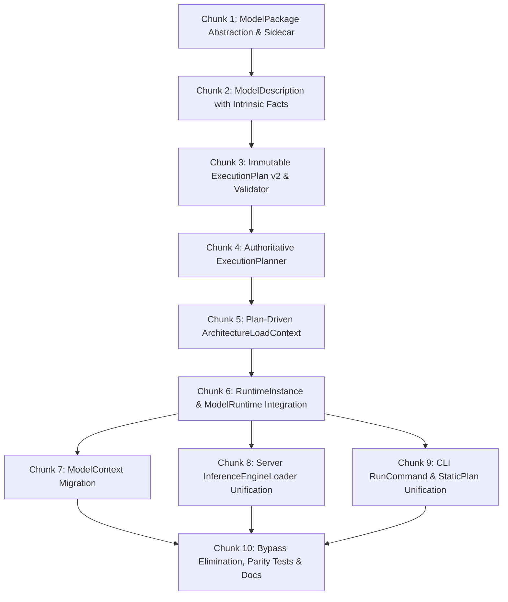

# Stingray: Make ExecutionPlan the Centre of Runtime Architecture

## 1. Objective & Target Architecture

Refactor Stingray so that execution policy is resolved once into an immutable, inspectable `ExecutionPlan`, and all runtime entry points (`ModelContext`, Server `InferenceEngineLoader`, and CLI `RunCommand`) consume that plan rather than rediscovering execution policy.

```
                External Model Data (GGUF, SafeTensors, Ollama)
                                      │
                                      ▼
                                 ModelPackage
                                      │
                                      ▼
                               ModelDescription
                     (semantic identity + immutable facts)
                                      │
                                      ▼
                              ExecutionPlanner
                     ├─ model requirements & planning facts
                     ├─ unified ExecutionRequest
                     ├─ hardware/backend capabilities
                     ├─ candidate evaluation
                     ├─ existing TierPlanner
                     └─ existing ForwardPassSelection
                                      │
                                      ▼
                           immutable ExecutionPlan
                           (strongly typed, no "auto")
                                      │
                                      ▼
                               RuntimeInstance
                 (Engine resource owner; wrapped in Server by ModelRuntime)
                                      │
                         ┌────────────┼────────────┐
                         ▼            ▼            ▼
                      State       Scheduler    Executor
                                                   │
                                                   ▼
                                         ArchitectureFactory
                                                   │
                                                   ▼
                                               ForwardPass
```

*Note:* `State` and `Scheduler` are future runtime seams. The immediate implementation stops at:
`ModelPackage` $\rightarrow$ `ModelDescription` $\rightarrow$ `ExecutionPlanner` $\rightarrow$ `ExecutionPlan` $\rightarrow$ `RuntimeInstance` $\rightarrow$ existing `InferenceEngine` / `ContinuousBatchingEngine`.

---

## 2. The Four Distinct Conceptual Boundaries

Stingray strictly distinguishes four separate questions:

| Concept | Question Answered | Key Responsibilities | What It Must NOT Contain |
| :--- | :--- | :--- | :--- |
| **`ModelPackage`** | *What files/components belong together?* | Compositional identity (weights, tokenizer, chat template, vision projector, draft model, configuration, licenses); digest-aware identity. | Machine-specific execution choices; model architecture parsing; hardware policy. Location paths are external to identity. |
| **`ModelDescription`** | *What is this model?* | Semantic identity (architecture ID, semantic family, state model, MoE, multimodal capabilities, verified backends, admission status) **plus** intrinsic planning facts (layer counts, head dims, Rope params, quantization info, GDN/MLA flags). | Machine-specific execution choices (no backend, GPU layers, context size, KV dtype). |
| **`ExecutionPlan`** | *How will this model run on this machine for this request?* | Concrete resolved runtime policy (backend, device, placement, GPU/CPU layer split, context size, KV dtype, batching mode, speculation mode, memory budget). Genuinely immutable collections (`ImmutableArray`). | Unresolved `"auto"` options; delegate instances; native handles; model weight copying; mutable collections. |
| **`RuntimeInstance`** | *What actual resources have been allocated to execute that plan?* | Concrete allocated resources (backend instances, forward pass, KV state memory, buffers, inference engine). Wrapped by `ModelRuntime` in the server layer. | Secondary policy selection; fallback logic; re-planning; reading policy from `Model.Parameters`. |

---

## 3. Package Layer Principles & Ollama Compatibility

1. **Logical Component Boundary, Not Physical Archive:**
   `ModelPackage` describes which external files constitute one model (e.g. single GGUF; GGUF + `mmproj`; GGUF + draft model; SafeTensors directory + tokenizer; or Ollama manifest + content-addressed blobs).
2. **Path Does Not Participate in Package Identity:**
   ```csharp
   public sealed record ModelPackageIdentity(
       string? ContentDigest,
       ModelFormat Format,
       ImmutableArray<ModelPackageComponentIdentity> Components);

   public interface IModelPackage
   {
       ModelPackageIdentity Identity { get; }
       string PrimaryPath { get; }
       ...
   }
   ```
   `PrimaryPath` is diagnostic location metadata, not part of identity equality.
   * **Digest Contract:** When content/component digests are available, identical package content at different paths produces the same `ModelPackageIdentity`. When no digest is available, identity is explicitly provisional; path remains location metadata and is never silently promoted to semantic identity.
   * For Ollama packages, the manifest digest is primary.
3. **Do NOT Invent a New Physical Stingray Package Format:**
   Stingray will not create a new `stingray-manifest` or blob layout. Where practical, Stingray understands and consumes the Ollama package representation (`manifest`, `blobs/sha256-...`) essentially as-is.
4. **No Internal Dependency on Ollama:**
   Ollama compatibility is an adapter representation (`IModelPackage`), not the core Stingray model architecture. Stingray can consume Ollama-compatible packages without Ollama being installed or running.
5. **Stingray-Specific Sidecar Metadata (`stingray.json`):**
   Stable Stingray-specific knowledge (architecture interpretation, admission status, verification evidence, verified backends, known limitations) is stored in a separate sidecar keyed to the package digest, without modifying the underlying weights.
   * **Crucial Rule:** `stingray.json` is strictly advisory/cached evidence. It **never grants admission and never overrides `ArchitectureRegistry` or executable policy**.
   * The sidecar contains versioning (`schema_version`, `model_digest`, `verification_profile_version`) to ensure stale evidence is invalidated across software releases.
6. **No Model Weights Shipped in Stingray:**
   Stingray packages/executables never bundle model weights. External model data remains stored on the user's system.
7. **Package Ownership vs. Reference:**
   Stingray distinguishes imported/reference packages (read-only, no lifecycle ownership) from Stingray-managed packages. Stingray does not assume unreferenced Ollama blobs survive external GC.
8. **No Model Manager Scope Creep:**
   No registry integration, downloads, authentication, or automatic updating in this phase. The scope is strictly *reading/understanding packages* to produce `ModelDescription`.

---

## 4. Fundamental Runtime Invariants

1. **The Planner Decides. The Plan Records. The Runtime Obeys:**
   Once an `ExecutionPlan` has been produced, runtime construction must never make another execution-policy decision.
   * `RuntimeInstance` **may**: validate model identity against the plan, verify required hardware, allocate memory, construct the forward pass via `ArchitectureDescriptor.ConstructForwardPass`, and instantiate the engine.
   * `RuntimeInstance` **must NOT**: choose another backend, choose GPU layer counts, invoke `TierPlanner`, invoke `ForwardPassSelection`, silently fall back to CPU, modify context size or KV dtype, or reinterpret `"auto"`.
   * `RuntimeInstance` **must NOT read policy from `Model.Parameters`**: It uses `Model` solely for tensors, metadata, tokenizer, and architecture identity.
2. **Explicit Failure Over Silent Fallback:**
   If the plan cannot be executed on the current machine (e.g. Vulkan device missing or insufficient VRAM), `RuntimeInstance.Create(plan)` throws an explicit `PlanNotExecutableException`. Re-planning is an explicit, separate operation via `ExecutionPlanner.Plan(...)`.
3. **`ExecutionRequest` Captures All Execution-Affecting Inputs:**
   Every input capable of changing backend selection, layer placement, forward-pass kind, state layout, KV configuration, batching support, speculative execution, or execution resources must be represented in `ExecutionRequest` and resolved into `ExecutionPlan`.
   * Includes: backend, GPU layer pin, context size, KV dtype, TurboQuant enable/mode/head dim, FlashAttention, Rope frequency base/scale overrides, execution thread counts, batch mode/max batch size, speculation mode, SnapKV budget, modality execution mode.
   * No execution-affecting values may remain hidden in `Model.Parameters`, `ContextParams`, environment variables, or CLI-only state after planning.
4. **`LoadFromPlan()` Has No Configuration Escape Hatch:**
   `InferenceEngineLoader.LoadFromPlan(plan)` executes the plan directly via `RuntimeInstance.Create(plan, model)`. It does not accept an unrestricted `baseOptions` that could override planned settings. `Load(options)` converges onto the same pipeline by translating `options` into `ExecutionRequest`, running `ExecutionPlanner`, and calling `RuntimeInstance.Create(plan)`.
5. **Candidate Evaluation Belongs in the Planner, Not Runtime:**
   `ExecutionPlanner` may evaluate candidate backends/splits and reject them (e.g. evaluating Vulkan $\rightarrow$ finding an unsupported architecture $\rightarrow$ evaluating CPU $\rightarrow$ selecting CPU). The final plan records one authoritative choice. Runtime never substitutes backends.
6. **Model-Aware Backend Auto-Selection:**
   Backend selection does not merely check "is GPU available". It cross-references model requirements, `ArchitectureDescriptor` restrictions, backend capabilities, and established policy.
7. **`ModelContext` Owns the Plan for Its Runtime:**
   `ModelContext` owns the `ExecutionPlan` for the runtime it represents. Any change to execution-affecting configuration (such as `maxBatchSize` for continuous batching) requires a new plan and runtime, and never mutates or reconfigures an existing plan.
8. **Clean Integration with Server-Side `ModelRuntime`:**
   `RuntimeInstance` integrates with the existing multi-model runtime architecture without duplicating responsibilities:
   ```
   ModelRuntimeManager
       │
       ▼
   ModelRuntime
       │
       ├── Model / ModelPackage
       ├── ExecutionPlan
       └── RuntimeInstance
              ├── backend resources
              ├── forward pass
              └── inference engine
   ```
   * `RuntimeInstance` lives in the Engine/runtime layer and owns the concrete resources required by one `ExecutionPlan`.
   * `ModelRuntime` remains in `OpenTail.Stingray.Server` and owns residency/lifetime around that runtime.
   * `ModelRuntimeManager` continues to own acquisition, eviction, resource admission, and disposal.
   * Do not move `ModelRuntime`/`ModelRuntimeManager` into Engine merely to satisfy the conceptual diagram.
9. **Eliminate Frontend-Specific Execution Policy:**
   Eliminate `ForwardPassFrontend.Cli` vs `ForwardPassFrontend.Server` divergence. All frontends map to `ExecutionRequest` $\rightarrow$ `ExecutionPlanner` $\rightarrow$ identical execution policy.
10. **Genuine Collection Immutability:**
    All collections in `ExecutionPlan` and its sub-plans are `ImmutableArray<T>` or defensively copied. Mutating planner temporary lists after plan creation cannot alter the plan.

---

## 5. Work Breakdown Structure (10 Manageable Chunks)



### Chunk 1: `ModelPackage` Abstraction & Sidecar Metadata
* **Goal:** Establish the logical component boundary and package representations under `src/OpenTail.Stingray.Engine/Packages/`.
* **Deliverables:**
  * `IModelPackage` interface with `ModelPackageIdentity Identity { get; }`, `string PrimaryPath { get; }`, and component enumeration.
  * `ModelPackageIdentity(string? ContentDigest, ModelFormat Format, ImmutableArray<ModelPackageComponentIdentity> Components)`.
  * Concrete adapters:
    * `LooseGgufModelPackage`: Single GGUF or GGUF + mmproj / draft model.
    * `SafeTensorsModelPackage`: Directory with tensors, tokenizer, and config.
    * `OllamaModelPackage`: Content-addressed blobs referenced by manifest.
  * `StingraySidecarMetadata`: Record for `stingray.json` containing `schema_version`, `model_digest`, `verification_profile_version`, `architecture`, `semantic_family`, `state_model`, `admission`, and `verified_capabilities`. Advisory only; never grants admission.
  * Unit tests validating package component resolution, path-independent identity equality, and sidecar serialization.

### Chunk 2: `ModelDescription` with Intrinsic Planning Facts
* **Goal:** Extract semantic model identity and the complete immutable planning facts snapshot under `src/OpenTail.Stingray.Engine/Planning/ModelDescription.cs`.
* **Deliverables:**
  * `ModelDescription(ModelPackageIdentity Identity, ModelSemanticDescription Semantics, ModelCapabilitySummary Capabilities, ModelResourceSummary Resources, ModelPlanningFacts PlanningFacts)`.
  * `ModelPlanningFacts`: Immutable snapshot containing all facts needed by `TierPlanner` and `ForwardPassSelection` without reopening disk files (layer count, context limit, head dimensions, KV head count, Rope theta/scale, GDN/SSM flags, MLA tensor flags, MoE routing properties, primary weight quantization type).
  * Factory method: `ModelDescription.FromPackage(IModelPackage package)`.
    * `FromPackage` may perform the one-time package/model inspection required to construct `ModelDescription`, including reading metadata/tensor descriptors, but `ExecutionPlanner` must consume the resulting snapshot and must not reopen the package/model files.
  * Unit tests validating that `ModelDescription` completely satisfies `ForwardPassRequest` requirements without disk re-reading.

### Chunk 3: `ExecutionPlan` Schema v2 & Structural Validation
* **Goal:** Refactor `ExecutionPlan.cs` into schema version 2 with strongly typed sub-plans, genuine collection immutability, and NativeAOT source-generated JSON.
* **Deliverables:**
  * Refactored `ExecutionPlan` referencing `ModelPackageIdentity PackageIdentity`, strongly typed `ForwardPassKind ForwardPassKind`, `BackendPlan BackendPlan`, `PlacementPlan Placement`, `StatePlan State`, `BatchingPlan Batching`, `SpeculationPlan Speculation`, `ModalityPlan Modality`, `MemoryPlan Memory`, and `PlanProvenance Provenance`.
  * All internal collections (`Decisions`, `Warnings`, `Components`) use `ImmutableArray<T>` or defensive copies.
  * Retain backward-compatible property accessors (`ModelPath`, `Backend`, `GpuLayers`, `ContextSize`, etc.).
  * `ExecutionPlanValidator`:
    * Enforces strongly typed invariants: `Backend != "auto"`, `GpuLayers >= 0`, `CpuLayers >= 0`, `ContextSize > 0`.
    * Enforces cross-field semantic invariants (e.g. Vulkan passes require Vulkan backend; batching mode matches pass capabilities).
  * Extend `ExecutionPlanJsonContext` for all sub-plans.

### Chunk 4: Authoritative `ExecutionPlanner`
* **Goal:** Centralize all runtime policy orchestration in `ExecutionPlanner.cs`.
* **Deliverables:**
  * `ExecutionRequest`: Complete record capturing all execution-affecting inputs (backend, layer pins, context size, KV dtype, TurboQuant settings, FlashAttention, Rope overrides, thread counts, batch settings, speculation settings, modality modes).
  * `ExecutionPlanner.Plan(ModelDescription model, ExecutionRequest request, BackendCapabilities capabilities)`:
    * Coordinates candidate evaluation (model-aware backend resolution, avoiding unsupported combinations).
    * Invokes `TierPlanner.Plan(...)` and `ForwardPassSelection.SelectPass(...)` internally.
    * Eliminates frontend-specific execution policy (`ForwardPassFrontend.Cli` vs `Server`).
    * Produces and validates an immutable `ExecutionPlan`.
  * Turn `ExecutionPlanBuilder.Build(...)` into a compatibility facade forwarding to `ExecutionPlanner`.

### Chunk 5: Plan-Driven `ArchitectureLoadContext`
* **Goal:** Connect architecture factories directly to the resolved plan.
* **Deliverables:**
  * Add `public required ExecutionPlan Plan { get; init; }` to `ArchitectureLoadContext`.
  * Derive existing context properties (`Decision`, `Backend`, `GpuLayers`, `Placement`) directly from `Plan`.
  * In `CommonForwardPassFactory`, branch directly on `ctx.Plan.ForwardPassKind`.
  * Preserve `ArchitectureDescriptor.ConstructForwardPass(context)` as the single factory seam (`ApplyLoadSetup` $\rightarrow$ `CreateForwardPass`).

### Chunk 6: `RuntimeInstance` Resource Boundary (Integrated with Server `ModelRuntime`)
* **Goal:** Implement the deterministic runtime resource allocator and engine construction boundary in `Engine` and integrate with `ModelRuntime` in `Server`.
* **Deliverables:**
  * `RuntimeInstance.Create(ExecutionPlan plan, Model model)` in `src/OpenTail.Stingray.Engine/Runtime/`:
    * Validates model architecture, format, and package digest against `plan.PackageIdentity`.
    * Verifies that the planned backend is operational; throws `PlanNotExecutableException` on mismatch or unavailability (zero silent fallbacks).
    * Never reads execution policy from `Model.Parameters`.
    * Allocates required backend instances (`CudaBackend`, `VulkanBackend`, `CpuBackend`).
    * Builds `ArchitectureLoadContext` and calls `descriptor.ConstructForwardPass(loadCtx)`.
    * Instantiates `ContinuousBatchingEngine` if `plan.Batching.Mode == BatchingMode.Continuous`, else `InferenceEngine`.
    * Exposes effective `ExecutionPlan` for test and telemetry inspection.
  * Integrate RuntimeInstance with the existing ModelRuntime architecture:
    * RuntimeInstance lives in the Engine/runtime layer and owns the concrete resources required by one ExecutionPlan.
    * ModelRuntime remains in OpenTail.Stingray.Server and owns residency/lifetime around that runtime.
    * ModelRuntimeManager continues to own acquisition, eviction, resource admission and disposal.
    * Do not move ModelRuntime/ModelRuntimeManager into Engine merely to satisfy the conceptual diagram.
    * Architecture hierarchy:
      ```
      ModelRuntimeManager
          │
          ▼
      ModelRuntime
          │
          ├── Model / ModelPackage
          ├── ExecutionPlan
          └── RuntimeInstance
                 ├── backend resources
                 ├── forward pass
                 └── inference engine
      ```

### Chunk 7: Migrate `ModelContext`
* **Goal:** Replace `BuildForwardPass(...)` policy rediscovery in `ModelContext`.
* **Deliverables:**
  * Expose `public ExecutionPlan ExecutionPlan { get; }` on `ModelContext`.
  * Ensure `ModelContext` owns the plan for the runtime it represents.
  * Refactor `CreateDefaultEngine()` and `CreateContinuousBatchingEngine(maxBatchSize)` to request a plan with the corresponding `BatchingMode` and instantiate via `RuntimeInstance.Create(plan, _model)`.
  * Eliminate the 300-line private backend/selection switch in `ModelContext`.

### Chunk 8: Migrate Server (`InferenceEngineLoader`)
* **Goal:** Ensure `LoadFromPlan()` never rediscovers policy.
* **Deliverables:**
  * Update `LoadFromPlan(plan)`:
    * Validate package identity.
    * Call `RuntimeInstance.Create(plan, model)`.
    * **No `baseOptions` override; never call `Load(options)`.**
  * Update `Load(options)`:
    * Map options to `ExecutionRequest`.
    * Call `ExecutionPlanner.Default.Plan(...)`.
    * Call `RuntimeInstance.Create(plan, model)`.

### Chunk 9: Migrate CLI (`RunCommand` and `StaticPlanCommand`)
* **Goal:** Unify all CLI execution paths onto `ExecutionPlanner` and `RuntimeInstance`.
* **Deliverables:**
  * In `RunCommand.cs`: map CLI arguments to `ExecutionRequest`, invoke `ExecutionPlanner`, and execute via `RuntimeInstance`.
  * `--explain` prints the exact `ExecutionPlan` being executed.
  * In `StaticPlanCommand.cs`: invoke `ExecutionPlanner` directly.

### Chunk 10: Bypass Elimination, Contract Tests & Parity Verification
* **Goal:** Eliminate dead policy code and prove cross-frontend consistency.
* **Deliverables:**
  * Audit codebase: no calls to `ForwardPassSelection.SelectPass()` or `TierPlanner.Plan()` outside `ExecutionPlanner` and tests.
  * `ExecutionPlannerTests`: Verify deterministic mapping of requests to concrete plans; verify candidate rejection during auto planning.
  * `ExecutionPlanRuntimeTests`: Prove runtime executes the exact planned forward pass and placement without re-planning; verify `RuntimeInstance.ExecutionPlan == plan`.
  * `PlanNotExecutableTests`: Verify explicit failure when hardware cannot satisfy the plan.
  * Cross-Frontend Parity Tests: Verify that CLI, Server, and `ModelContext` produce identical plans for identical inputs.
  * Update documentation in `docs/3-product-and-runtime/`.

---

## 6. Acceptance Criteria Checklist

- [ ] `ModelPackage` is a logical abstraction over external model components.
- [ ] `ModelPackageIdentity` does not contain file paths in its record equality.
- [ ] When digests are available, identical packages at different paths produce identical `ModelPackageIdentity`; without digests, identity is explicitly provisional.
- [ ] No new competing Stingray physical model/blob format is introduced.
- [ ] Ollama-compatible model packages can be consumed without Ollama installed/running.
- [ ] Ollama/package blobs can be reused without unnecessary duplicate weight copies.
- [ ] Stingray-specific metadata is represented separately from package storage (`stingray.json` sidecar).
- [ ] Stingray sidecar metadata is keyed to model/package identity and is advisory only (never overrides admission).
- [ ] `ModelDescription` contains an immutable snapshot of all intrinsic planning facts.
- [ ] `ModelDescription.FromPackage` performs the one-time inspection; `ExecutionPlanner` never reopens model files.
- [ ] `ExecutionRequest` contains every execution-affecting option; no hidden policy in `Model.Parameters` or environment.
- [ ] `ExecutionPlan` is genuinely immutable (`ImmutableArray<T>`) and contains concrete choices (no `"auto"`).
- [ ] `ExecutionPlan` validation checks strongly typed invariants without overly restrictive universal equations.
- [ ] Candidate evaluation during planning is model-aware and distinct from runtime fallback.
- [ ] `RuntimeInstance` executes the plan strictly without re-planning or reading `Model.Parameters`.
- [ ] `RuntimeInstance` (Engine) integrates cleanly with `ModelRuntime` and `ModelRuntimeManager` (Server).
- [ ] `RuntimeInstance` exposes the effective `ExecutionPlan` for inspection and contract verification.
- [ ] Existing `ForwardPassSelection` and `TierPlanner` policy is orchestrated by `ExecutionPlanner`, not rewritten.
- [ ] Frontend-specific execution policy (`ForwardPassFrontend.Cli` vs `Server`) is eliminated.
- [ ] CLI, Server, and `ModelContext` all converge on the same planning path.
- [ ] `LoadFromPlan()` does not accept execution-altering options and never calls `Load()`.
- [ ] The runtime cannot silently substitute CPU/Vulkan/CUDA for the backend in the plan.
- [ ] Plan JSON serializes/deserializes using NativeAOT source generation.
- [ ] Parity tests confirm identical plans across all frontends.
- [ ] No model weights are bundled into Stingray itself.
