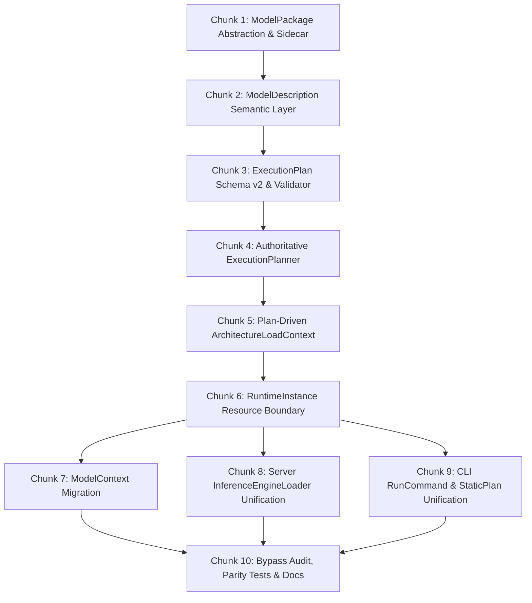

# Stingray: Make ExecutionPlan the Centre of Runtime Architecture

## 1. Objective & Target Architecture

Refactor Stingray so that execution policy is resolved once into an immutable, inspectable `ExecutionPlan`, and all runtime entry points (`ModelContext`, Server `InferenceEngineLoader`, and CLI `RunCommand`) consume that plan rather than rediscovering execution policy.

```
                         ModelPackage
                              │
              ┌───────────────┼───────────────┐
              │               │               │
             GGUF        SafeTensors       Ollama
            package         package        package
              │               │               │
              └───────────────┼───────────────┘
                              ▼
                     ModelDescription
                              │
                    ┌─────────▼─────────┐
                    │ ExecutionPlanner  │
                    │                   │
                    │ model semantics   │
                    │ request           │
                    │ hardware         │
                    │ memory            │
                    └─────────┬─────────┘
                              ▼
                        ExecutionPlan
                              │
                              ▼
                       RuntimeInstance
                              │
                 ┌────────────┼────────────┐
                 ▼            ▼            ▼
               State       Scheduler    Executor
                                            │
                                            ▼
                                  ArchitectureFactory
                                            │
                                            ▼
                                        ForwardPass
```

*Note:* `State` and `Scheduler` are future runtime seams; the immediate implementation stops at:
`ModelPackage` $\rightarrow$ `ModelDescription` $\rightarrow$ `ExecutionPlanner` $\rightarrow$ `ExecutionPlan` $\rightarrow$ `RuntimeInstance` $\rightarrow$ existing `InferenceEngine` / `ContinuousBatchingEngine`.

---

## 2. The Four Distinct Conceptual Boundaries

Stingray strictly distinguishes four separate questions:

| Concept | Question Answered | Key Responsibilities | What It Must NOT Contain |
| :--- | :--- | :--- | :--- |
| **`ModelPackage`** | *What files/components belong together?* | Compositional identity (weights, tokenizer, chat template, vision projector, draft model, configuration, licenses); digest-aware identity. | Machine-specific execution choices; model architecture parsing; hardware policy. |
| **`ModelDescription`** | *What is this model?* | Semantic identity (architecture ID, semantic family, state model, MoE, multimodal capabilities, verified backends, admission status). | Machine-specific execution choices (no backend, GPU layers, context, KV dtype). |
| **`ExecutionPlan`** | *How will this model run on this machine for this request?* | Concrete resolved runtime policy (backend, device, placement, GPU/CPU layer split, context size, KV dtype, batching mode, speculation mode, memory budget). | Unresolved `"auto"` options; delegate instances; native handles; model weight copying. |
| **`RuntimeInstance`** | *What actual resources have been allocated to execute that plan?* | Concrete allocated resources (backend instances, forward pass, KV state memory, buffers, inference engine). | Secondary policy selection; fallback logic; re-planning. |

---

## 3. Package Layer Principles & Ollama Compatibility

1. **Logical Component Boundary, Not Physical Archive:**
   `ModelPackage` describes which external files constitute one model (e.g. single GGUF; GGUF + `mmproj`; GGUF + draft model; SafeTensors directory + tokenizer; or Ollama manifest + content-addressed blobs).
2. **Do NOT Invent a New Physical Stingray Package Format:**
   Stingray will not create a new `stingray-manifest` or blob layout. Where practical, Stingray understands and consumes the Ollama package representation (`manifest`, `blobs/sha256-...`) essentially as-is.
3. **No Internal Dependency on Ollama:**
   Ollama compatibility is an adapter representation (`IModelPackage`), not the core Stingray model architecture. Stingray can consume Ollama-compatible packages without Ollama being installed or running.
4. **Stingray-Specific Sidecar Metadata (`stingray.json`):**
   Stable Stingray-specific knowledge (architecture interpretation, admission status, verification evidence, verified backends, known limitations) is stored in a separate sidecar keyed to the package digest, without modifying the underlying weights.
5. **No Model Weights Shipped in Stingray:**
   Stingray packages/executables never bundle model weights. External model data remains stored on the user's system.
6. **Package Ownership vs. Reference:**
   Stingray distinguishes imported/reference packages (read-only, no lifecycle ownership) from Stingray-managed packages. Stingray does not assume unreferenced Ollama blobs survive external GC.
7. **No Model Manager Scope Creep:**
   No registry integration, downloads, authentication, or automatic updating in this phase. The scope is strictly *reading/understanding packages* to produce `ModelDescription`.

---

## 4. Fundamental Runtime Invariants

1. **No Runtime Policy Re-evaluation:**
   Once an `ExecutionPlan` has been produced, runtime construction must never make another execution-policy decision.
   * `RuntimeInstance` **may**: validate model identity against the plan, verify required hardware, allocate memory, construct the forward pass via `ArchitectureDescriptor.ConstructForwardPass`, and instantiate the engine.
   * `RuntimeInstance` **must NOT**: choose another backend, choose GPU layer counts, invoke `TierPlanner`, invoke `ForwardPassSelection`, silently fall back to CPU, modify context size or KV dtype, or reinterpret `"auto"`.
2. **Explicit Failure Over Silent Fallback:**
   If the plan cannot be executed on the current machine (e.g. Vulkan device missing or insufficient VRAM), `RuntimeInstance.Create(plan)` throws an explicit `PlanNotExecutableException`. Re-planning is an explicit, separate operation via `ExecutionPlanner.Plan(...)`.
3. **`LoadFromPlan()` Never Calls `Load(options)`:**
   `InferenceEngineLoader.LoadFromPlan(plan)` directly invokes `RuntimeInstance.Create(plan, model)`. `Load(options)` converges onto the same pipeline by translating `options` into `ExecutionRequest`, running `ExecutionPlanner`, and calling `RuntimeInstance.Create(plan)`.
4. **Preserve Established Policy:**
   `ForwardPassSelection` contains extensive battle-tested policy (SSM/GDN, MoE, TurboQuant, SafeTensors, MLA, partial offload, DSpark). `ExecutionPlanner` coordinates this existing logic rather than prematurely simplifying it.

---

## 5. Work Breakdown Structure (10 Manageable Chunks)



### Chunk 1: `ModelPackage` Abstraction & Sidecar Metadata
* **Goal:** Establish the logical component boundary and package representations under `src/OpenTail.Stingray.Engine/Packages/`.
* **Deliverables:**
  * `IModelPackage` interface and `ModelPackageIdentity(string? ContentDigest, ModelFormat Format, string PrimaryPath, IReadOnlyList<ModelPackageComponent> Components)`.
  * Concrete adapters:
    * `LooseGgufModelPackage`: Single GGUF or GGUF + mmproj / draft model.
    * `SafeTensorsModelPackage`: Directory with tensors, tokenizer, and config.
    * `OllamaModelPackage`: Content-addressed blobs referenced by manifest.
  * `StingraySidecarMetadata`: Record for `stingray.json` containing `schema_version`, `model_digest`, `architecture`, `semantic_family`, `state_model`, `admission`, and `verified_capabilities`.
  * Unit tests validating package component resolution and sidecar serialization.

### Chunk 2: `ModelDescription` Semantic Layer
* **Goal:** Extract semantic model identity from `ModelPackage` into `src/OpenTail.Stingray.Engine/Planning/ModelDescription.cs`.
* **Deliverables:**
  * `ModelDescription(ModelPackageIdentity Identity, ModelSemanticDescription Semantics, ModelCapabilitySummary Capabilities, ModelResourceSummary Resources)`.
  * `ModelSemanticDescription(ForwardPassFamily ForwardPassFamily, ModelStateKind StateKind, bool IsMoE, bool SupportsImageInput, bool SupportsAudioInput)`.
  * `ModelStateKind` enum: `None`, `Kv`, `Recurrent`, `Hybrid`.
  * Factory method: `ModelDescription.FromPackage(IModelPackage package)`.
  * Unit tests validating semantic extraction for GGUF and SafeTensors packages.

### Chunk 3: `ExecutionPlan` Schema v2 & Structural Validation
* **Goal:** Refactor `ExecutionPlan.cs` into schema version 2 with resolved sub-plans and NativeAOT source-generated JSON.
* **Deliverables:**
  * Refactored `ExecutionPlan` referencing `ModelPackageIdentity PackageIdentity`, `ForwardPassKind ForwardPassKind`, `BackendPlan BackendPlan`, `PlacementPlan Placement`, `StatePlan State`, `BatchingPlan Batching`, `SpeculationPlan Speculation`, `ModalityPlan Modality`, `MemoryPlan Memory`, and `PlanProvenance Provenance`.
  * Retain backward-compatible property accessors (`ModelPath`, `Backend`, `GpuLayers`, `ContextSize`, etc.).
  * `ExecutionPlanValidator`:
    * Enforces `Backend != "auto"`, `GpuLayers >= 0`, `CpuLayers >= 0`, `GpuLayers + CpuLayers == TotalLayers`, `ContextSize > 0`.
    * Enforces cross-field invariants (e.g. Vulkan passes require Vulkan backend; continuous batching requires batch-capable forward pass and `MaxBatchSize > 1`).
  * Extend `ExecutionPlanJsonContext` for all sub-plans.

### Chunk 4: Authoritative `ExecutionPlanner`
* **Goal:** Centralize all runtime policy in `ExecutionPlanner.cs`.
* **Deliverables:**
  * `ExecutionPlanner.Plan(ModelDescription model, ExecutionRequest request, BackendCapabilities capabilities)`.
  * Workflow:
    1. Resolve semantic architecture via `ArchitectureRegistry.Resolve()`.
    2. Normalize concrete backend (resolve `"auto"` to `cuda`, `vulkan`, or `cpu` based on capabilities).
    3. Run `TierPlanner.Plan(...)` once to establish layer placement (`PlacementPlan`).
    4. Call `ForwardPassSelection.SelectPass(backend, gpuLayers)` once to yield `ForwardPassKind`.
    5. Resolve batching, TurboQuant, speculation, and memory budgets.
    6. Construct and validate immutable `ExecutionPlan`.
  * Turn `ExecutionPlanBuilder.Build(...)` into a compatibility facade forwarding to `ExecutionPlanner`.

### Chunk 5: Plan-Driven `ArchitectureLoadContext`
* **Goal:** Connect architecture factories directly to the resolved plan.
* **Deliverables:**
  * Add `public required ExecutionPlan Plan { get; init; }` to `ArchitectureLoadContext`.
  * Derive existing context properties (`Decision`, `Backend`, `GpuLayers`, `Placement`) directly from `Plan`.
  * In `CommonForwardPassFactory`, branch directly on `ctx.Plan.ForwardPassKind`.
  * Preserve `ArchitectureDescriptor.ConstructForwardPass(context)` as the single factory seam (`ApplyLoadSetup` $\rightarrow$ `CreateForwardPass`).

### Chunk 6: `RuntimeInstance` Resource Boundary
* **Goal:** Implement the deterministic runtime resource allocator and engine construction boundary.
* **Deliverables:**
  * `RuntimeInstance.Create(ExecutionPlan plan, Model model)`:
    * Validates model architecture, format, and package digest against `plan.PackageIdentity`.
    * Verifies that the planned backend is operational; throws `PlanNotExecutableException` on mismatch or unavailability (zero silent fallbacks).
    * Allocates required backend instances (`CudaBackend`, `VulkanBackend`, `CpuBackend`).
    * Builds `ArchitectureLoadContext` and calls `descriptor.ConstructForwardPass(loadCtx)`.
    * Instantiates `ContinuousBatchingEngine` if `plan.Batching.Mode == "continuous"`, else `InferenceEngine`.
    * Manages owned disposables.

### Chunk 7: Migrate `ModelContext`
* **Goal:** Replace `BuildForwardPass(...)` policy rediscovery in `ModelContext`.
* **Deliverables:**
  * Expose `public ExecutionPlan ExecutionPlan { get; }` on `ModelContext`.
  * Refactor `CreateDefaultEngine()` and `CreateContinuousBatchingEngine()` to request an `ExecutionPlan` from `ExecutionPlanner` and instantiate via `RuntimeInstance.Create(plan, _model)`.
  * Eliminate the 300-line private backend/selection switch in `ModelContext`.

### Chunk 8: Migrate Server (`InferenceEngineLoader`)
* **Goal:** Ensure `LoadFromPlan()` never rediscovers policy.
* **Deliverables:**
  * Update `LoadFromPlan(plan, baseOptions)`:
    * Validate package identity.
    * Call `RuntimeInstance.Create(plan, model)`.
    * **Never call `Load(options)` from `LoadFromPlan()`.**
  * Update `Load(options)`:
    * Map options to `ExecutionRequest`.
    * Call `ExecutionPlanner.Default.Plan(...)`.
    * Call `RuntimeInstance.Create(plan, model)`.

### Chunk 9: Migrate CLI (`RunCommand` and `StaticPlanCommand`)
* **Goal:** Unify all CLI execution paths onto `ExecutionPlanner` and `RuntimeInstance`.
* **Deliverables:**
  * In `RunCommand.cs`: map CLI arguments to `ExecutionRequest`, invoke `ExecutionPlanner`, and execute via `RuntimeInstance`.
  * `--explain` prints the exact `ExecutionPlan` being executed.
  * In `StaticPlanCommand.cs`: invoke `ExecutionPlanner` directly.

### Chunk 10: Bypass Audit, Contract Tests & Parity Verification
* **Goal:** Eliminate dead policy code and prove cross-frontend consistency.
* **Deliverables:**
  * Audit codebase: no calls to `ForwardPassSelection.SelectPass()` or `TierPlanner.Plan()` outside `ExecutionPlanner` and tests.
  * `ExecutionPlannerTests`: Verify deterministic mapping of requests to concrete plans.
  * `ExecutionPlanRuntimeTests`: Prove runtime executes the exact planned forward pass and placement without re-planning.
  * `PlanNotExecutableTests`: Verify explicit failure when hardware cannot satisfy the plan.
  * Cross-Frontend Parity Tests: Verify that CLI, Server, and `ModelContext` produce identical plans for identical inputs.
  * Update documentation in `docs/3-product-and-runtime/`.

---

## 6. Acceptance Criteria Checklist

- [ ] `ModelPackage` is a logical abstraction over external model components.
- [ ] No new competing Stingray physical model/blob format is introduced.
- [ ] Ollama-compatible model packages can be consumed without Ollama installed/running.
- [ ] Ollama/package blobs can be reused without unnecessary duplicate weight copies.
- [ ] Stingray-specific metadata is represented separately from package storage (`stingray.json` sidecar).
- [ ] Stingray sidecar metadata is keyed to model/package identity.
- [ ] Model package identity is digest-aware where digest information exists.
- [ ] `ModelPath` remains diagnostic/compatibility information, not the ultimate identity.
- [ ] Package metadata does not contain machine-specific execution choices.
- [ ] `ModelDescription` is the semantic model layer.
- [ ] `ExecutionPlan` is the machine/request-specific execution layer (no `"auto"`).
- [ ] `RuntimeInstance` never reparses execution policy.
- [ ] Existing `ForwardPassSelection` policy is preserved during migration.
- [ ] Existing `TierPlanner` policy is preserved during migration.
- [ ] CLI, Server, and `ModelContext` all converge on the same planning path.
- [ ] `LoadFromPlan()` does not convert the plan back into options and call `Load()`.
- [ ] The runtime cannot silently substitute CPU/Vulkan/CUDA for the backend in the plan.
- [ ] Plan JSON can be serialized/deserialized using NativeAOT source generation.
- [ ] Plan validation catches structurally inconsistent plans.
- [ ] Parity tests confirm identical plans across all frontends.
- [ ] No model weights are bundled into Stingray itself.
