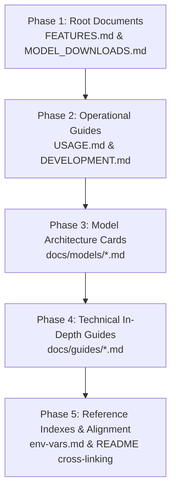

# Documentation Architecture Plan: Elevating Stingray to World-Class Documentation

> **Status:** Proposed  
> **Date:** October 9, 2026  
> **Scope:** Full documentation suite for OpenTail.Stingray (Core, Engine, Audio, Vision, Diffusion, Server, CLI)  
> **Inspiration:** Derived from the comprehensive documentation hierarchy demonstrated in `examples/TensorSharp/TensorSharp/`, tailored specifically to OpenTail.Stingray's pure managed C#, NativeAOT, and unified multimodal (Text, Vision, Audio, Diffusion) architecture.

---

## 1. Executive Summary & Objective

High-performance AI runtimes often succeed or fail on the strength of their documentation. While OpenTail.Stingray possesses extraordinary technical capabilities—pure C# with zero Python and zero P/Invoke dependencies, SIMD-accelerated CPU kernels, Vulkan/CUDA backends, 11+ vision architectures, a complete neural TTS/ASR audio stack, and diffusion pipelines—its existing documentation is largely distributed across internal engineering scratchpads (`docs/1-correctness/`, `docs/2-coverage/`, historical task plans).

By analyzing the structure, breadth, and depth of TensorSharp's documentation (`FEATURES.md`, `USAGE.md`, `DEVELOPMENT.md`, `MODEL_DOWNLOADS.md`, `docs/models/` architecture cards, and focused technical guides), we can establish a comprehensive, publication-grade documentation architecture for Stingray.

This plan defines the exact blueprint for Stingray's documentation suite, designed to be implemented systematically in a subsequent session.

---

## 2. Structural Paradigm: What Works in TensorSharp vs. Stingray's Identity

| Dimension | TensorSharp's Approach | Stingray's Tailored Adaptation |
|---|---|---|
| **High-level feature inventory** | Massive `FEATURES.md` (117 KB) covering every supported family, quantization, batching, and speed trick. | **`FEATURES.md`**: Showcase Stingray's superpowers: 100% managed C#, NativeAOT deployment, Multimodal Vision (11+ architectures), Studio Audio Stack (TTS + STT + DSP), SOTA Diffusion (FLUX, Z-Image-Turbo, SD 3.5), and TurboQuant KV cache. |
| **Operational & User Manual** | Exhaustive `USAGE.md` (268 KB) covering backends, CLI options, server endpoints, and config JSON files. | **`USAGE.md`**: Dual-track manual covering the **path-free front door** (`stingray chat`, `stingray speak`, `stingray transcribe`, `setup`, `models`) alongside advanced CLI switches, ASP.NET Core server hosting, and programmatic C# APIs. |
| **Architecture & Engineering** | `DEVELOPMENT.md` (114 KB) describing project boundaries, native GGML/CUDA builds, and prerequisites. | **`DEVELOPMENT.md`**: Guide to Stingray's managed architecture: SIMD vector math, memory layout, Vulkan/CUDA compute pipelines, NativeAOT compilation, test suites (Golden Parity, Fast vs Heavy), and contributing rules. |
| **Verified Checkpoint Registry** | `MODEL_DOWNLOADS.md` (60 KB) with exact Hugging Face repos, pinned revisions, companion files, and VRAM tiers. | **`MODEL_DOWNLOADS.md`**: Complete registry of verified GGUFs, ONNX Piper voices, Whisper checkpoints, DiT weights, companion mmproj files, and tokenizers with SHA-256 hashes and memory requirements. |
| **Model Deep Dives** | Architecture Cards (`docs/models/*.md`) detailing specific model tensor mechanics, RoPE variants, and memory profiles. | **`docs/models/`**: Dedicated architecture cards for major model families (Llama/Mistral, Qwen2.5/3, Gemma4, DeepSeek, Vision Projectors, Audio TTS/STT, Diffusion). |
| **Targeted Guides** | Deep technical guides on Paged Attention, Speculative Decoding, Embeddings, and Agent Skills. | **`docs/guides/`**: Specialized guides on TurboQuant KV Caching, SIMD Acceleration, Jinja Chat Templates & Structured Output, Vision Pipelines, and Audio DSP. |
| **Environment Inventory** | `env_var_feature_matrix.md` detailing all active variables, types, and defaults. | **`docs/reference/environment-variables.md`**: Exhaustive reference of all `STINGRAY_*` environment variables, their effects, defaults, and diagnostic switches. |

---

## 3. The Target Documentation Taxonomy

```
OpenTail.Stingray/
├── README.md                              <- Package & repository front door (clean quick start, API overview)
├── FEATURES.md                            <- Comprehensive capability catalog & architectural superpowers
├── USAGE.md                               <- Complete operator manual (CLI front door, flags, API server, C# SDK)
├── DEVELOPMENT.md                         <- Architecture guide, repo layout, SIMD internals, NativeAOT, testing
├── MODEL_DOWNLOADS.md                     <- Verified Hugging Face checkpoint registry (GGUF, mmproj, ONNX, hashes)
├── docs/
│   ├── README.md                          <- Documentation index & reading paths
│   ├── models/                            <- Model Family Architecture Cards
│   │   ├── README.md                      <- Overview of supported architectures & formats
│   │   ├── llama-mistral.md               <- Llama 3/4, Mistral, Mixtral MoE
│   │   ├── qwen-series.md                 <- Qwen 2.5, Qwen 3.5/3.6, Qwen-Coder
│   │   ├── deepseek.md                    <- DeepSeek-V3, R1, Multi-head Latent Attention (MLA)
│   │   ├── gemma-series.md                <- Gemma 3, Gemma 4, E4B multimodal
│   │   ├── multimodal-vision.md           <- Unified Vision Towers (Qwen-VL, Pixtral, DeepSeek-OCR, LLaVA, InternVL)
│   │   ├── audio-tts.md                   <- Piper VITS, Kokoro-82M, Qwen3-TTS, XTTS-v2, F5-TTS
│   │   ├── audio-stt.md                   <- Whisper (Tiny to Large-v3), Parakeet CTC, Voxtral Realtime
│   │   └── diffusion-media.md             <- FLUX, Z-Image-Turbo, SD 3.5, Wan Video, Stable Audio
│   ├── guides/                            <- Technical Feature Deep Dives
│   │   ├── 01-turboquant-kv-cache.md      <- KV cache quantization, page allocation, and prefix caching
│   │   ├── 02-simd-and-kernels.md         <- AVX-512, AVX2, ARM Neon, SIMD GEMM, and worker threading
│   │   ├── 03-structured-outputs.md       <- Jinja templates, grammar masking, JSON schema constraints, tool calls
│   │   ├── 04-hardware-backends.md        <- CPU, Vulkan, CUDA, and SmartOffloadPlanner
│   │   ├── 05-server-and-endpoints.md     <- ASP.NET Core OpenAI & Anthropic compatible API server
│   │   └── 06-native-aot-deployment.md    <- Trimming, publishing single-file binaries, Docker containers
│   └── reference/                         <- Exhaustive Indexes & Specs
│       ├── environment-variables.md       <- Complete STINGRAY_* configuration variable index
│       ├── cli-option-inventory.md        <- Option catalog (276 options across 29 commands)
│       ├── public-api-contracts.md        <- Model, Context, Executor, ChatSession lifecycle specification
│       └── troubleshooting.md             <- Hardware diagnostics, memory fitting, common failure modes
```

---

## 4. Detailed Specification of Core Documents

### Document 1: `FEATURES.md` (Capability Catalog)
- **Target Size:** ~40–60 KB.
- **Audience:** Architects, evaluators, and developers choosing an AI engine.
- **Sections:**
  1. **Core Runtime Highlights**: Pure managed C#, NativeAOT compatibility, zero external C++ runtime dependencies.
  2. **Text Models & Architectures**: Attention patterns, dense vs. MoE (Qwen, Mixtral, DeepSeek, Gemma, SmolLM2), sliding-window attention, rotary embeddings (RoPE/M-RoPE).
  3. **Multimodal Vision Stack**: The 11+ supported vision architectures (DeepSeek-OCR, Qwen2.5-VL, Pixtral, LLaVA-NeXT, InternVL, MiniCPM-V, GLM-4V, Nemotron-VL).
  4. **Neural Voice & Speech Stack**: Complete TTS (Piper, Kokoro, F5-TTS, Qwen3-TTS, XTTS-v2 voice cloning) and STT (Whisper, Parakeet, Voxtral, Silero VAD) capabilities.
  5. **Diffusion & Generative Media**: FLUX.1/2/3, SD 3.5, Z-Image-Turbo, Wan Video, Stable Audio.
  6. **Performance & Hardware Features**: AVX-512/AVX2/Neon SIMD, Vulkan cooperative-matrix GPU shaders, CUDA offload, TurboQuant KV cache, Radix prefix reuse.
  7. **Constrained Generation**: Tool calling, JSON schema BNF grammar constraints, Jinja chat templating.
  8. **Enterprise & Deployment**: Drop-in OpenAI/Anthropic HTTP server, OpenTelemetry/EngineEvents telemetry.

### Document 2: `USAGE.md` (Comprehensive User & Operator Manual)
- **Target Size:** ~50–70 KB.
- **Audience:** CLI users, DevOps engineers, and application developers.
- **Sections:**
  1. **Quick Start & The Front Door**:
     - `stingray setup <task>` (chat, speak, transcribe).
     - `stingray chat` (interactive & single-turn options).
     - `stingray speak` (speech synthesis with Piper voice assets).
     - `stingray transcribe` (speech-to-text with Whisper).
     - `stingray models` (installation status and next steps).
  2. **Advanced CLI Operations**:
     - Path-oriented chat (`stingray -m <path> -p <prompt>`).
     - Low-level TTS (`stingray tts -e kokoro -v af_heart -t "..."`).
     - Speech-to-text with timestamps (`stingray stt --vad --no-timestamps`).
     - Image & video generation (`stingray image`, diffusion parameters).
     - Model management (`stingray pull`, `stingray hash`, `stingray doctor`).
  3. **Hardware & Backend Selection**:
     - Flags: `-g|--backend auto|cpu|vulkan|cuda`, `--gpu-layers <N>`.
     - CPU thread controls and SIMD optimizations.
  4. **Inference Parameters Matrix**:
     - Temperature, Top-K, Top-P, Min-P, penalties (repeat, presence, frequency), stop tokens, thinking budgets.
  5. **ASP.NET Core Server Integration**:
     - Hosting `OpenTail.Stingray.Server`, endpoints (`/v1/chat/completions`, `/v1/models`, `/v1/audio/transcriptions`, `/v1/audio/speech`).
  6. **C# Public API Recipes**:
     - High-level chat: `Model.Load` $\to$ `CreateContext` $\to$ `InteractiveExecutor` $\to$ `ChatSession`.
     - Direct TTS: `PiperPipeline.FromConfigFile(...)`.
     - Direct STT: `WhisperPipeline.Load(...)`.

### Document 3: `DEVELOPMENT.md` (Architecture, Contributing & Test Guide)
- **Target Size:** ~40–50 KB.
- **Audience:** Contributors, engine developers, and internal maintainers.
- **Sections:**
  1. **Prerequisites & Tooling**: .NET 10 SDK, IDE configuration, optional Vulkan/CUDA toolchains.
  2. **Solution Architecture & Projects**:
     - `OpenTail.Stingray.Core` (tensor types, GGUF/Safetensors loaders, model home, catalog).
     - `OpenTail.Stingray.Cpu` / `.Vulkan` / `.Cuda` (hardware execution backends).
     - `OpenTail.Stingray.Engine` (lifecycle facade, executors, chat sessions).
     - `OpenTail.Stingray.Audio` (TTS, STT, audio DSP pipelines).
     - `OpenTail.Stingray.Vision` / `.Diffusion` (vision encoders, diffusion schedulers).
     - `OpenTail.Stingray.Cli` / `.Server` (frontends and services).
  3. **Managed SIMD & Memory Layout**:
     - Zero-allocation buffer reuse, tensor slices, pinned pointers.
     - SIMD kernel dispatch for RMSNorm, RoPE, Softmax, GEMM.
  4. **NativeAOT & Trimming Guidelines**:
     - Keeping code NativeAOT-safe, reflection-free serializers, `DynamicallyAccessedMembers` attributes.
  5. **Test Harness & Verification Framework**:
     - Unit tests (`Tests.Core`, `Tests.Cli`).
     - Fast forward-pass verification (`Tests.ForwardPass.Fast`).
     - Golden parity capture and verification (`stingray capture-golden`, `admit-arch`).
     - Handling real-model fixtures without silent false passes.

### Document 4: `MODEL_DOWNLOADS.md` (Verified Checkpoint Registry)
- **Target Size:** ~30–40 KB.
- **Audience:** Users downloading models for development and production.
- **Sections:**
  1. **Curated First-Run Defaults** (Pinned with exact SHA-256 and URLs):
     - `qwen2.5-0.5b` (Chat default).
     - `piper-lessac` (Speech default).
     - `whisper-base` (Transcription default).
  2. **Recommended Text LLMs by Hardware Tier**:
     - 4 GB RAM / APU: SmolLM2-135M, SmolLM2-360M, Qwen2.5-0.5B.
     - 8–16 GB RAM / GPU: Qwen2.5-7B, Llama-3.2-3B, Mistral-7B, DeepSeek-R1-Distill-Qwen-7B.
     - 32+ GB RAM / Multi-GPU: Qwen2.5-32B, Mixtral 8x7B, DeepSeek-V3 quantized.
  3. **Multimodal Vision Projectors**:
     - Qwen2.5-VL mmproj, Pixtral mmproj, DeepSeek-OCR2 mmproj, LLaVA-NeXT mmproj.
  4. **Studio Audio Assets**:
     - Piper voice models (`.onnx` + `.onnx.json`).
     - Kokoro GGUF voices (`.bin` / `.gguf`).
     - Whisper GGML models (`ggml-tiny.bin` through `ggml-large-v3.bin`).
  5. **Diffusion Checkpoints**:
     - FLUX.1-schnell, SD 3.5 Medium, Z-Image-Turbo GGUFs.

### Document 5: Architecture Cards (`docs/models/*.md`)
Create dedicated, high-detail cards for key families:
1. `llama-mistral.md`: Standard RoPE, sliding window attention, SwiGLU, Mixtral MoE top-2 routing.
2. `qwen-series.md`: Qwen 2.5 dense and hybrid recurrent layers, Jinja tool call formatting.
3. `deepseek.md`: Multi-head Latent Attention (MLA), DeepSeek-V3/R1 MoE routing, thinking mode markers.
4. `gemma-series.md`: Gemma 3 / 4 architecture, sliding window, multimodal vision integration.
5. `multimodal-vision.md`: How vision embeddings are merged into language sequence tokens across all 11 architectures.
6. `audio-tts.md`: VITS phonemizer integration, Flow-Matching DiT, neural vocoders, voice cloning.
7. `audio-stt.md`: Whisper encoder-decoder architecture, Mel spectrogram DSP, Silero VAD chunking.
8. `diffusion-media.md`: FlowMatch Euler schedulers, text conditioning with T5/CLIP, VAE tiling.

### Document 6: Technical Guides (`docs/guides/*.md`)
1. `01-turboquant-kv-cache.md`: TurboQuant FP8/INT4 KV caching, paged allocation, prefix caching mechanics.
2. `02-simd-and-kernels.md`: SIMD kernel design in C#, AVX-512 / AVX2 / ARM Neon vectorization, thread pool governors.
3. `03-structured-outputs.md`: Grammar masking, JSON Schema to BNF compilation, deterministic tool call generation.
4. `04-hardware-backends.md`: SmartOffloadPlanner, APU/iGPU memory mapping, Vulkan compute shader compilation.
5. `05-server-and-endpoints.md`: Deploying high-throughput local AI microservices with ASP.NET Core.
6. `06-native-aot-deployment.md`: Building and distributing single-executable zero-dependency binaries.

### Document 7: Reference Documents (`docs/reference/*.md`)
1. `environment-variables.md`: Complete index of all `STINGRAY_*` environment variables with default values, valid ranges, and associated features.
2. `cli-option-inventory.md`: Keep synchronized with `gen-cli-option-inventory.ps1`.
3. `public-api-contracts.md`: Ownership, lifecycle, disposal protocol, and thread safety specification for `Model`, `ModelContext`, and `ChatSession`.
4. `troubleshooting.md`: Diagnosing out-of-memory errors, Vulkan driver initialization, audio sampling issues, and model loading errors.

---

## 5. Phased Implementation Roadmap

When executing this plan in the subsequent session, work should proceed in logical, bite-sized phases:



### Phase 1: Core Foundation & Feature Catalog
- Author `FEATURES.md` celebrating Stingray's unique managed/multimodal architecture.
- Author `MODEL_DOWNLOADS.md` with verified checksums and URLs.
- *Verification Gate:* Check markdown links and ensure all mentioned architectures and tools match active code.

### Phase 2: Operations & Developer Guide
- Author `USAGE.md` detailing front-door and advanced workflows.
- Author `DEVELOPMENT.md` detailing architecture, SIMD kernels, NativeAOT, and test harnesses.
- *Verification Gate:* Run all documented CLI commands in dry-run/help mode to ensure option accuracy.

### Phase 3: Model Architecture Cards
- Author the 8 architecture cards in `docs/models/`.
- Document tensor requirements, companion files, RoPE dimensions, and sampling considerations for each family.
- *Verification Gate:* Cross-reference metadata keys and tensor names with `ArchitectureLiterals.txt` and model loaders.

### Phase 4: Technical Deep Dive Guides
- Author the 6 technical guides in `docs/guides/`.
- Provide concrete C# code snippets compiling against the public API.
- *Verification Gate:* Verify that code snippets in guides use the public API facade without calling internal types.

### Phase 5: Reference Indexes & Cross-Linking Verification
- Author `docs/reference/environment-variables.md` by auditing all `STINGRAY_*` references in the solution.
- Update root `README.md` and `docs/README.md` with comprehensive navigation links.
- *Verification Gate:* Run link-checking across all documents to ensure zero dead links.

---

## 6. Definition of Done

The documentation initiative will be complete when:
1. Every major domain of Stingray (LLM, Vision, Audio TTS, Audio STT, Diffusion, Server, CLI) has dedicated, detailed coverage.
2. Every code snippet in the documentation compiles against the public NuGet package API (`Model.Load`, `CreateContext`, `ChatSession`).
3. CLI options and commands described in the documentation match the real CLI option inventory.
4. Model download links and SHA-256 checksums are verified and accurate.
5. A developer discovering the repository can proceed effortlessly from evaluation (`FEATURES.md`) to installation (`USAGE.md`) to deep contribution (`DEVELOPMENT.md`).
