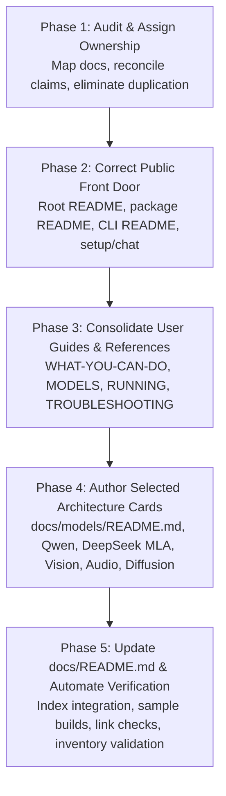

# Documentation Architecture Plan: Grounded Consolidation & Authoritative References

> **Status:** Implementation-Ready Plan (Incorporating Review Corrections)  
> **Date:** October 9, 2026  
> **Scope:** Full documentation suite for OpenTail.Stingray (Core, Engine, Audio, Vision, Diffusion, Server, CLI)  
> **Core Standard:** A capability may be advertised only when its implementation status and verification evidence support the exact claim being made. The existence of a class, a port, or an architecture name is not sufficient evidence.

---

## 1. Executive Summary & Review Findings

High-performance AI runtimes require documentation that is accurate, well-structured, and immediately useful to diverse audiences. While external reference documentation (such as `TensorSharp`) demonstrates an attractive high-level taxonomy, importing that structure wholesale into OpenTail.Stingray without grounding risks serious failures:
1. **Ignoring established documentation:** Stingray already possesses an extensive, differentiated documentation suite ([`docs/README.md`](../README.md), [`docs/WHAT-YOU-CAN-DO.md`](../WHAT-YOU-CAN-DO.md), [`docs/MODELS.md`](../MODELS.md), [`docs/RUNNING.md`](../RUNNING.md), [`docs/STATUS.md`](../STATUS.md), [`docs/TROUBLESHOOTING.md`](../TROUBLESHOOTING.md), and automated reference inventories). Creating parallel root documents (`FEATURES.md`, `USAGE.md`, `DEVELOPMENT.md`, `MODEL_DOWNLOADS.md`) without an explicit migration and ownership map creates unmaintainable duplication.
2. **Technical inaccuracies & ungrounded claims:**
   - *FLUX.3:* As explicitly documented in [`docs/STATUS.md`](../STATUS.md#L191), `Flux3DiT` and `Flux3Pipeline` are speculative scaffolding not corresponding to any released model; FLUX.3 is not a real coverage target and must never be advertised.
   - *Vulkan Cooperative Matrix:* As recorded in [`GR_performance.md`](../../GR_performance.md#L121), no cooperative-matrix Vulkan shader path is implemented or enabled in the device chain. Hardware extension detection is not an implemented shader feature.
   - *Qwen Image Status:* While DiT and VAE decode are verified against real weights, text conditioning integration remains open; it is not yet an end-to-end supported pipeline.
   - *Hardware Qualification:* Claims regarding hardware backends (e.g. ARM Neon, CUDA) must explicitly distinguish code presence from verified hardware execution.
3. **Bloat via arbitrary size targets:** Targets like "40–60 KB" encourage encyclopedic repetition. Stingray's documentation must prioritize concise, high-signal entry points that link to single canonical sources of truth.

This revised plan establishes an authoritative consolidation strategy: assigning explicit ownership to canonical documents, defining a migration map, establishing three-tier code example standards, connecting the documentation index (`docs/README.md`), and sequencing implementation from audit and front-door verification to selected architecture cards and automated CI checks.

---

## 2. Core Architectural Principles

1. **Audience-Separated Information Flow:**
   - *Evaluators & Architects:* Need a high-level, verified capability summary explaining what Stingray can do, why pure managed C# matters, and known boundary conditions.
   - *Operators & End Users:* Need working command-line instructions, hardware requirements, and troubleshooting advice.
   - *Application Developers:* Need public C# NuGet API recipes (`Model.Load`, `CreateContext`, `ChatSession`, audio/vision pipelines) compiling against published packages.
   - *Engine Contributors:* Need internal memory layouts, SIMD conventions, Vulkan/CUDA compute dispatch, and test harness execution rules.
2. **Strict Verification Grounding:**
   - Advertised capabilities, model support, and hardware acceleration claims must be backed by current entries in [`docs/STATUS.md`](../STATUS.md), real test fixtures, or measured benchmarks in [`docs/RUNNING.md`](../RUNNING.md).
   - Features with partial implementation must be explicitly classified by verification tier (End-to-End Supported, Components Verified / Integration Incomplete, or Active Implementation / Validation).
3. **No Duplicate Hand-Maintained Inventories:**
   - Machine-verifiable data (CLI options, environment variables, model catalog bundles) must be generated or backed by code registries.
4. **Implementation-Focused Architecture Cards:**
   - Technical deep dives must document what the Stingray engine *actually implements* (tensor layouts, buffer reuse, custom kernels, attention masks), not just replicate upstream academic papers.

---

## 3. Single Sources of Truth (SSOT)

To eliminate contradictory drift across documentation, every category of information is assigned an unambiguous canonical source:

| Information Domain | Canonical Source of Truth | Secondary / Gateway Documents (Link to SSOT) | Governance & Automation Rule |
|---|---|---|---|
| **High-level capabilities & runtime boundaries** | [`docs/WHAT-YOU-CAN-DO.md`](../WHAT-YOU-CAN-DO.md) (grounded in [`docs/STATUS.md`](../STATUS.md)) | Root [`README.md`](../../README.md), optional root `FEATURES.md` | Must only cite verified features; no unreleased or speculative models. |
| **Model support, verification evidence & test status** | [`docs/STATUS.md`](../STATUS.md) | Capability summaries, model guides | Every entry cites specific test fixtures or evidence logs. Distinguishes verified vs. scaffolding. |
| **Recommended models & download guidance** | [`docs/MODELS.md`](../MODELS.md) | Task guides, CLI help | Curated, tested checkpoints organized by task and hardware tier. |
| **Measured performance, RAM requirements & commands** | [`docs/RUNNING.md`](../RUNNING.md) and [`PerformanceLeague.md`](../../PerformanceLeague.md) | Front door READMEs | Measured wall-clock numbers, batch latencies, TTFA, and peak RAM on defined hardware. |
| **First-run catalogue bundles & hashes** | `ModelCatalog.cs` in `OpenTail.Stingray.Core` | `stingray setup --help`, [`src/OpenTail.Stingray.Cli/README.md`](../../src/OpenTail.Stingray.Cli/README.md) | Pinned source registry with verified SHA-256 hashes for out-of-the-box bundles (`qwen2.5-0.5b`, `piper-lessac`, `whisper-base`). |
| **Actual CLI commands & options** | Generated [`docs/reference/cli-option-inventory.md`](../reference/cli-option-inventory.md) | [`src/OpenTail.Stingray.Cli/README.md`](../../src/OpenTail.Stingray.Cli/README.md), task guides | Auto-generated via `gen-cli-option-inventory.ps1`; validated by CLI contract tests. No manual duplicate tables. |
| **Environment variables & diagnostic flags** | Generated / Regulated [`docs/reference/env-var-inventory.md`](../reference/env-var-inventory.md) | Developer guide, troubleshooting | Reconciled against source registry (`StingrayEnv.cs`). Never maintained as a disconnected manual markdown list. |
| **Step-by-step task workflows** | [`docs/guides/`](../guides/README.md) | `USAGE.md`, CLI README | Task-oriented recipes (chat, speak, transcribe, vision, server hosting). |
| **Engine internals & architectural decisions** | [`docs/reference/OpenTail.Stingray-Design.md`](../reference/OpenTail.Stingray-Design.md) and ADRs | `DEVELOPMENT.md` | Subsystem architecture, memory management, session lifecycle ADRs. |
| **Diagnostic & recovery workflows** | [`docs/TROUBLESHOOTING.md`](../TROUBLESHOOTING.md) | CLI doctor, server guide | Real failure modes (VRAM exhaustion, missing Vulkan layers, audio clipping, token formatting). |
| **Documentation Index & Reading Paths** | [`docs/README.md`](../README.md) | Root [`README.md`](../../README.md) | Canonical index of all documentation, architecture cards, guides, and engineering backlogs. |

---

## 4. Migration & Ownership Map

Rather than replacing or duplicating existing files, each proposed and existing document has an explicit action and boundary:

| Document | Action | Current Responsibility | Target Responsibility & Relationship to SSOT |
|---|---|---|---|
| **Root [`README.md`](../../README.md)** | **Enhance Front Door** | Project introduction, basic commands, architecture bullets | Public front door: clear value proposition, path-free first run (`stingray setup` $\to$ `stingray chat`), NuGet quickstart, concise navigation links to [`docs/`](../README.md). Aligned with developer surface plan. |
| **[`docs/README.md`](../README.md)** | **Expand & Index** | Documentation index and reading paths | Central documentation index. Updated to map the audience pathways, model architecture cards (`docs/models/`), and technical deep dives (`docs/guides/`). |
| **`FEATURES.md` (Root)** | **Concise Gateway (Optional)** | Does not exist | If created, must be a *concise gateway* highlighting key technical superpowers (pure C#, NativeAOT, unified multimodal) and linking directly to [`docs/WHAT-YOU-CAN-DO.md`](../WHAT-YOU-CAN-DO.md) and [`docs/STATUS.md`](../STATUS.md). |
| **[`docs/WHAT-YOU-CAN-DO.md`](../WHAT-YOU-CAN-DO.md)** | **Retain as Canonical** | Plain-language capability overview | Canonical overview of user-facing capabilities across LLM, Vision, Audio (TTS/STT), and Diffusion. Grounded strictly in [`docs/STATUS.md`](../STATUS.md). |
| **`USAGE.md` (Root)** | **Concise Operational Index** | Does not exist | Serves as a streamlined operational hub linking to the CLI front door, ASP.NET Core server docs, and task guides in [`docs/guides/`](../guides/README.md). Does NOT duplicate option tables or guide bodies. |
| **[`src/OpenTail.Stingray.Cli/README.md`](../../src/OpenTail.Stingray.Cli/README.md)** | **Retain & Align** | CLI commands, usage examples, global options | Primary documentation for the CLI tool. Updated to feature path-free verbs (`chat`, `speak`, `transcribe`, `setup`, `models`) alongside path-based flags. Links to generated option inventory. |
| **[`src/OpenTail.Stingray.Server/README.md`](../../src/OpenTail.Stingray.Server/README.md)** | **Retain Canonical** | HTTP API endpoints, OpenAI/Anthropic spec | Canonical documentation for running the REST/SSE microservice. |
| **[`src/OpenTail.Stingray/README.md`](../../src/OpenTail.Stingray/README.md)** | **Retain Canonical** | Package summary, quick API snippet | Canonical package README for NuGet consumers. Demonstrates public API contract. |
| **`DEVELOPMENT.md` (Root)** | **New Contributor Gateway** | Does not exist; content in CLAUDE.md & reference docs | Contributor onboarding: building from source (.NET 10 SDK), solution structure, running test tiers (Core, Fast, Golden Parity), NativeAOT guidelines. Links to [`docs/reference/OpenTail.Stingray-Design.md`](../reference/OpenTail.Stingray-Design.md) for deep design. |
| **[`docs/MODELS.md`](../MODELS.md)** | **Retain Canonical** | Curated model recommendations, download links | Canonical curated guide for choosing models by hardware tier and task. No separate `MODEL_DOWNLOADS.md` root file; keep all model guidance consolidated here. |
| **[`docs/RUNNING.md`](../RUNNING.md)** | **Retain Canonical** | Memory usage, actual commands, measured speeds | Canonical performance and execution log. Contains verified RAM numbers and benchmark commands. |
| **[`docs/STATUS.md`](../STATUS.md)** | **Retain Canonical** | Verification status, test evidence, support matrix | Single source of truth for verification evidence. |
| **[`docs/TROUBLESHOOTING.md`](../TROUBLESHOOTING.md)** | **Retain Canonical** | Diagnostic steps, error resolutions | Canonical troubleshooting guide. |
| **[`docs/reference/env-var-inventory.md`](../reference/env-var-inventory.md)** | **Retain Canonical (Regulated)** | Regulated inventory of `STINGRAY_*` variables | Canonical reference for environment variables. Must NOT create a handwritten `environment-variables.md`. |
| **[`docs/reference/cli-option-inventory.md`](../reference/cli-option-inventory.md)** | **Retain Canonical (Generated)** | Complete CLI option inventory | Canonical generated CLI inventory. |
| **[`docs/reference/061-coverage-tooling.md`](../reference/061-coverage-tooling.md)** | **Retain Canonical** | HF download tools (`pull`, `admit-arch`) | Maintain as the technical reference for model acquisition and architecture onboarding tooling. |

---

## 5. Technical Correction & Public Feature Scope

The documentation suite must accurately reflect Stingray's verified state across all model families and compute backends:

### Diffusion & Generative Media Classification

To maintain technical integrity, diffusion models are organized into four explicit verification tiers:

1. **End-to-End Supported:**
   - The complete user-visible generation pipeline has passed verified execution checks and produces expected outputs.
   - *Included:* Stable Diffusion 1.5 (with ControlNet conditioning), SDXL, SD 3/3.5, FLUX.1, Z-Image-Turbo, Wan 2.1/2.2 Video, HunyuanVideo, LTX-Video, Stable Audio 3, MusicGen, AudioGen.
2. **Components Verified; Integration Incomplete:**
   - Individual subcomponents (e.g. DiT, VAE) have passed forward-pass tests against real weights, but the complete end-to-end user-facing pipeline is not yet finalized.
   - *Included:* **Qwen Image** (DiT forward pass verified against real weights with 4 real bugs fixed; VAE decode verified reusing WanVaeDecoder3D; real LLM text conditioning remains outstanding as documented in [`docs/STATUS.md`](../STATUS.md#L191)).
3. **Active Implementation / Convergence Debugging:**
   - Real weight loaders and full pipeline components exist, but output quality or convergence is under active investigation.
   - *Included:* **FLUX.2** (DiT, text conditioning via Mistral taps, and VAE unshuffle are wired and produce finite output; currently undergoing convergence/patchify debugging to resolve tiling artifacts).
4. **Speculative / Unreleased (Strictly Excluded):**
   - Code represents speculative scaffolding not corresponding to any released model.
   - *Excluded:* **FLUX.3** (`Flux3DiT` / `Flux3Pipeline` closed as speculative code; strictly prohibited from public feature listings).

### Hardware & Compute Backends Qualification

1. **CPU Execution:**
   - Fully verified on x64 hardware with SIMD acceleration (AVX-512, AVX2, FMA) across quantized GEMM (Q4_K, Q6_K, Q8_0, etc.), RMSNorm, RoPE, and Softmax.
   - *ARM Neon:* Code paths exist in `OpenTail.Stingray.Cpu`, but must be explicitly qualified as *code implemented; unverified on physical hardware runner* until tested on dedicated ARM64 machines (per `docs/9-external-hardware/`).
2. **Vulkan Execution:**
   - Verified compute pipeline with SPIR-V shader dispatch, weight-stationary GEMM for supported quants, and shared-memory FlashAttention.
   - *Cooperative Matrix:* **STRICTLY EXCLUDED.** While `HasCooperativeMatrix` extension detection exists in code, no cooperative-matrix shader pipeline is implemented or enabled (per [`GR_performance.md`](../../GR_performance.md#L121)). Public documentation must accurately state that Vulkan attention and GEMM utilize standard compute shaders.
3. **CUDA Execution:**
   - Managed CUDA driver interop backend exists in `OpenTail.Stingray.Cuda`, but must be explicitly documented with hardware prerequisites (NVIDIA GPU, CUDA driver) per `docs/9-external-hardware/`.

---

## 6. Code Example & Verification Standards

To prevent unbuildable or misleading code in documentation without imposing inappropriate constraints on explanatory internals, code examples are divided into three formal tiers:

```mermaid
graph TD
    subgraph T1 [Tier 1: Public Application Examples]
        E1[Target: NuGet Consumers] --> V1[Must compile in clean external project]
        V1 --> A1[Uses only OpenTail.Stingray public API]
    end
    subgraph T2 [Tier 2: CLI Command Examples]
        E2[Target: Terminal Operators] --> V2[Checked against generated CLI inventory]
        V2 --> A2[Exercised by CLI smoke tests]
    end
    subgraph T3 [Tier 3: Internal Engineering & Architecture]
        E3[Target: Engine Contributors] --> V3[Builds against repo test harness]
        V3 --> A3[Explains SIMD / Memory / Shaders; pseudocode clearly marked]
    end
```



### Tier 1: Public Application Examples
- **Scope:** Root README, NuGet package README, public API quickstarts, getting started guides.
- **Rule:** Must compile cleanly in a standalone C# console application referencing only the published `OpenTail.Stingray` package and documented framework dependencies (.NET 10). Must be runnable by accepting an explicit model path argument or resolving through `ModelHome`.
- **Canonical Pattern:**
  ```csharp
  using OpenTail.Stingray;
  using OpenTail.Stingray.Executors;

  // Resolve model from command-line argument, or fall back to installed ModelHome default
  string modelPath = args.Length > 0 
      ? args[0] 
      : ModelHome.ResolveModelPath("qwen2.5-0.5b");

  using var model = Model.Load(modelPath);
  using var context = model.CreateContext(new ContextParams { ContextSize = 2048 });
  var session = new ChatSession(new InteractiveExecutor(context));

  await foreach (var token in session.ChatAsync("Explain SIMD in one sentence."))
  {
      Console.Write(token);
  }
  ```
- **Validation:** Automated test in `Tests.Core` that builds an isolated sample project against the packed `.nupkg`.

### Tier 2: CLI Command Examples
- **Scope:** CLI README, operational manual, task guides, troubleshooting.
- **Rule:** Every command flag and subverb must be cross-checked against `docs/reference/cli-option-inventory.md`. Representative commands must be exercised by CLI smoke tests or dry-run validation.
- **Canonical Patterns:**
  - Front-door task verbs: `stingray setup chat`, `stingray chat`, `stingray speak "Hello"`, `stingray transcribe audio.wav`.
  - Advanced path flags: `stingray -m <path> -p <prompt> --backend vulkan --gpu-layers 33`.

### Tier 3: Internal Engineering & Architecture Examples
- **Scope:** Architecture cards (`docs/models/`), developer guide (`DEVELOPMENT.md`), SIMD and kernel guides.
- **Rule:** May reference internal engine types (`Span<float>`, `QuantizedTensor`, `TensorSpan`, `SimdOps`, Vulkan descriptor sets). Must compile within the internal solution test harness, or be explicitly labelled as `// Conceptual / Pseudocode`.

---

## 7. Selected Architecture Cards & Technical Guides

Rather than authoring speculative or generic guides, we focus on subjects that provide durable engineering value and document Stingray's actual implementation:

### Model Architecture Cards (`docs/models/`)

1. **`docs/models/README.md`**:
   - Index of all architecture cards, detailing format support (GGUF, SafeTensors, ONNX) and verification criteria.
2. **`qwen-series.md`**:
   - Covers Qwen 2.5 dense models and hybrid architectures.
   - Explains RoPE frequency base scaling, sliding window attention, and Jinja chat template formatting for tool calling.
3. **`deepseek.md`**:
   - Multi-head Latent Attention (MLA) mechanics: compressed latent vector KV caching vs standard MHA/GQA.
   - DeepSeek-V3 / R1 Mixture-of-Experts (MoE) routing, top-k expert selection, and thinking tag handling.
4. **`multimodal-vision.md`**:
   - Explains the unified vision tower abstraction across supported architectures (Qwen2.5-VL, Pixtral, DeepSeek-OCR, LLaVA, InternVL).
   - Details how image patch embeddings are projected and merged into the text token stream before context ingestion.
5. **`audio-pipelines.md`**:
   - TTS: Piper VITS phonemizer integration, Kokoro GGUF voices, and streaming audio chunk delivery.
   - STT: Whisper encoder-decoder forward pass, Mel spectrogram DSP, and Silero VAD segmentation.
6. **`diffusion-pipelines.md`**:
   - Flow-matching DiT mechanics, Euler schedulers, and text conditioning (T5/CLIP).
   - Details status of FLUX.1, SD 3.5, Wan Video, Z-Image-Turbo, ongoing FLUX.2 convergence work, and Qwen Image component verification. Excludes FLUX.3.

### Focused Technical Guides (`docs/guides/`)

1. **`turboquant-kv-cache.md`**: KV cache quantization (FP8, INT4), paged memory allocation, and prefix cache reuse.
2. **`managed-simd-kernels.md`**: Pure C# vectorization using `System.Runtime.Intrinsics`, AVX-512 / AVX2 / Neon dispatch, and cache-conscious GEMM loops.
3. **`hardware-backends.md`**: Execution backend selection (CPU, Vulkan, CUDA), memory offloading, and shader compilation.
4. **`api-server-and-endpoints.md`**: Hosting the ASP.NET Core server with OpenAI and Anthropic API compatibility, streaming SSE tokens, and health endpoints.
5. **`native-aot-deployment.md`**: Compiling zero-dependency single-file executables, trimming annotations, and containerization.

---

## 8. Re-Sequenced Implementation Roadmap



### Phase 1: Audit & Assign Ownership
- **Goal:** Establish clear boundaries and remove dead/contradictory drafts before creating any new documentation.
- **Tasks:**
  1. Audit existing `docs/` files against the Single Source of Truth table.
  2. Confirm removal of speculative claims (FLUX.3, cooperative-matrix Vulkan) from all active drafts.
  3. Ensure `docs/reference/env-var-inventory.md` and `docs/reference/cli-option-inventory.md` are up to date with code.
- **Verification Gate:** Verification table approved; zero ungrounded technical claims in active documentation backlog.

### Phase 2: Correct the Public Front Door
- **Goal:** Make the first-touch experience seamless for evaluators and developers discovering Stingray.
- **Prerequisite:** Completed implementation of [Public Developer Surface and Front Door Plan](2026-10-09-public-developer-surface-and-front-door-plan.md).
- **Tasks:**
  1. Update root [`README.md`](../../README.md) to showcase the path-free first run (`stingray setup` $\to$ `stingray chat`), NuGet package usage, and clear links into [`docs/`](../README.md).
  2. Align [`src/OpenTail.Stingray.Cli/README.md`](../../src/OpenTail.Stingray.Cli/README.md) and [`src/OpenTail.Stingray/README.md`](../../src/OpenTail.Stingray/README.md) with the verified public API surface.
  3. Author concise `DEVELOPMENT.md` for contributor onboarding (prerequisites, solution structure, test commands).
- **Verification Gate:** Verified against implemented CLI and packed `OpenTail.Stingray.1.0.7.nupkg`. A new user following the README can build the project, run tests, and execute `stingray --help` with zero broken links.

### Phase 3: Consolidate Existing User Guides & References
- **Goal:** Strengthen existing documentation without creating redundant parallel files.
- **Tasks:**
  1. Review and refine [`docs/WHAT-YOU-CAN-DO.md`](../WHAT-YOU-CAN-DO.md) against [`docs/STATUS.md`](../STATUS.md).
  2. Verify that [`docs/MODELS.md`](../MODELS.md) and [`docs/RUNNING.md`](../RUNNING.md) provide consistent recommendations, exact commands, and measured memory figures.
  3. Ensure [`docs/TROUBLESHOOTING.md`](../TROUBLESHOOTING.md) covers common setup issues (Vulkan device selection, audio backend fallbacks, out-of-memory mitigation).
- **Verification Gate:** All documented commands and model names in user guides are consistent with the CLI option inventory and model catalog.

### Phase 4: Author Selected Architecture Cards & Technical Guides
- **Goal:** Provide high-value, durable technical deep dives into core subsystems.
- **Tasks:**
  1. Create `docs/models/README.md` and author the architecture cards: `qwen-series.md`, `deepseek.md`, `multimodal-vision.md`, `audio-pipelines.md`, `diffusion-pipelines.md`.
  2. Author focused technical guides in `docs/guides/`: `turboquant-kv-cache.md`, `managed-simd-kernels.md`, `hardware-backends.md`, `api-server-and-endpoints.md`, `native-aot-deployment.md`.
- **Verification Gate:** Code snippets and tensor flows in architecture cards match the actual implementation in `OpenTail.Stingray.Engine`, `Core`, and hardware backends.

### Phase 5: Integrate Documentation Index & Automate Verification
- **Goal:** Integrate all documentation into `docs/README.md` and ensure documentation never silently breaks.
- **Tasks:**
  1. Update [`docs/README.md`](../README.md) to integrate the new audience pathways, model architecture cards, and technical guides. Ensure every new document is reachable from the index.
  2. Add an automated test that builds an external sample console app using the packed NuGet package (verifies Tier 1 examples).
  3. Validate markdown internal links across `README.md` and `docs/`.
  4. Validate that CLI help outputs and option inventory remain synchronized.
  5. Ensure all feature claims in `WHAT-YOU-CAN-DO.md` and READMEs are backed by active entries in `STATUS.md`.
- **Verification Gate:** CI / local test suite executes and passes all documentation validation checks; zero unreachable or broken links.

---

## 9. Definition of Done

The documentation initiative is successfully completed when:
1. **Zero Unverified Claims:** No references to unreleased models (FLUX.3) or unimplemented hardware shaders (cooperative matrix Vulkan) exist in public documentation. Qwen Image and FLUX.2 are classified in their precise component/convergence verification tiers.
2. **Clear Ownership Established:** Every document has a defined scope and links to its canonical source of truth; zero duplicate hand-maintained registries exist.
3. **Verified Code Snippets:** All public API snippets compile against the published NuGet package; CLI examples match the generated inventory.
4. **Discoverable Index:** Every guide and architecture card is reachable from [`docs/README.md`](../README.md) or [`docs/models/README.md`](../models/README.md).
5. **Working Front Door:** The root README and package README provide an immediate, verified path from discovery to first inference, tested against real packages.
6. **Sustainable CI Checks:** Automated gates prevent link breakage and inventory drift.
