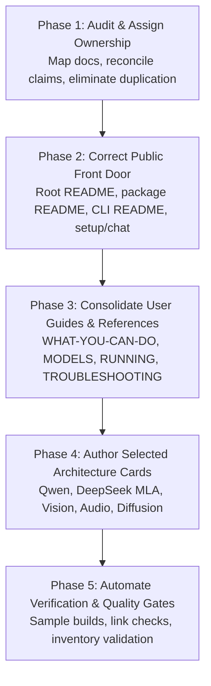

# Documentation Architecture Plan: Grounded Consolidation & Authoritative References

> **Status:** Revised Plan (Addressing Architecture & Evidence Review)  
> **Date:** October 9, 2026  
> **Scope:** Full documentation suite for OpenTail.Stingray (Core, Engine, Audio, Vision, Diffusion, Server, CLI)  
> **Core Standard:** A capability may be advertised only when its implementation status and verification evidence support the exact claim being made. The existence of a class, a port, or an architecture name is not sufficient evidence.

---

## 1. Executive Summary & Review Findings

High-performance AI runtimes require documentation that is accurate, well-structured, and immediately useful to diverse audiences. While external reference documentation (such as `TensorSharp`) demonstrates an attractive high-level taxonomy, importing that structure wholesale into OpenTail.Stingray risks introducing severe problems:
1. **Ignoring established documentation:** Stingray already possesses an extensive, differentiated documentation suite ([`docs/README.md`](file:///c:/Git-Public/OpenTail.Stingray/docs/README.md), [`docs/WHAT-YOU-CAN-DO.md`](file:///c:/Git-Public/OpenTail.Stingray/docs/WHAT-YOU-CAN-DO.md), [`docs/MODELS.md`](file:///c:/Git-Public/OpenTail.Stingray/docs/MODELS.md), [`docs/RUNNING.md`](file:///c:/Git-Public/OpenTail.Stingray/docs/RUNNING.md), [`docs/STATUS.md`](file:///c:/Git-Public/OpenTail.Stingray/docs/STATUS.md), [`docs/TROUBLESHOOTING.md`](file:///c:/Git-Public/OpenTail.Stingray/docs/TROUBLESHOOTING.md), and automated reference inventories). Creating parallel root documents (`FEATURES.md`, `USAGE.md`, `DEVELOPMENT.md`, `MODEL_DOWNLOADS.md`) without an explicit migration and ownership map creates unmaintainable duplication.
2. **Technical inaccuracies & ungrounded claims:**
   - *FLUX.3:* As explicitly documented in [`docs/STATUS.md`](file:///c:/Git-Public/OpenTail.Stingray/docs/STATUS.md#L191), `Flux3DiT` and `Flux3Pipeline` are speculative scaffolding not corresponding to any released model; FLUX.3 is not a real coverage target and must never be advertised.
   - *Vulkan Cooperative Matrix:* As recorded in [`GR_performance.md`](file:///c:/Git-Public/OpenTail.Stingray/GR_performance.md#L121), no cooperative-matrix Vulkan shader path is implemented or enabled in the device chain. Hardware extension detection is not an implemented shader feature.
3. **Bloat via arbitrary size targets:** Targets like "40–60 KB" encourage encyclopedic repetition. Stingray's documentation must prioritize concise, high-signal entry points that link to single canonical sources of truth.

This revised plan establishes an authoritative consolidation strategy: assigning explicit ownership to canonical documents, defining a migration map, establishing three-tier code example standards, and re-sequencing implementation from audit and front-door correction to selected architecture cards and automated verification.

---

## 2. Core Architectural Principles

1. **Audience-Separated Information Flow:**
   - *Evaluators & Architects:* Need a high-level, verified capability summary explaining what Stingray can do, why pure managed C# matters, and known boundary conditions.
   - *Operators & End Users:* Need working command-line instructions, hardware requirements, and troubleshooting advice.
   - *Application Developers:* Need public C# NuGet API recipes (`Model.Load`, `CreateContext`, `ChatSession`, audio/vision pipelines) compiling against published packages.
   - *Engine Contributors:* Need internal memory layouts, SIMD conventions, Vulkan/CUDA compute dispatch, and test harness execution rules.
2. **Strict Verification Grounding:**
   - Advertised capabilities, model support, and hardware acceleration claims must be backed by current entries in [`docs/STATUS.md`](file:///c:/Git-Public/OpenTail.Stingray/docs/STATUS.md), real test fixtures, or measured benchmarks in [`docs/RUNNING.md`](file:///c:/Git-Public/OpenTail.Stingray/docs/RUNNING.md).
3. **No Duplicate Hand-Maintained Inventories:**
   - Machine-verifiable data (CLI options, environment variables, model catalog bundles) must be generated or backed by code registries.
4. **Implementation-Focused Architecture Cards:**
   - Technical deep dives must document what the Stingray engine *actually implements* (tensor layouts, buffer reuse, custom kernels, attention masks), not just replicate upstream academic papers.

---

## 3. Single Sources of Truth (SSOT)

To eliminate contradictory drift across documentation, every category of information is assigned an unambiguous canonical source:

| Information Domain | Canonical Source of Truth | Secondary / Gateway Documents (Link to SSOT) | Governance & Automation Rule |
|---|---|---|---|
| **High-level capabilities & runtime boundaries** | [`docs/WHAT-YOU-CAN-DO.md`](file:///c:/Git-Public/OpenTail.Stingray/docs/WHAT-YOU-CAN-DO.md) (grounded in [`docs/STATUS.md`](file:///c:/Git-Public/OpenTail.Stingray/docs/STATUS.md)) | Root [`README.md`](file:///c:/Git-Public/OpenTail.Stingray/README.md), optional root `FEATURES.md` | Must only cite verified features; no unreleased or speculative models. |
| **Model support, verification evidence & test status** | [`docs/STATUS.md`](file:///c:/Git-Public/OpenTail.Stingray/docs/STATUS.md) | Capability summaries, model guides | Every entry cites specific test fixtures or evidence logs. Distinguishes verified vs. scaffolding. |
| **Recommended models & download guidance** | [`docs/MODELS.md`](file:///c:/Git-Public/OpenTail.Stingray/docs/MODELS.md) | Task guides, CLI help | Curated, tested checkpoints organized by task and hardware tier. |
| **Measured performance, RAM requirements & commands** | [`docs/RUNNING.md`](file:///c:/Git-Public/OpenTail.Stingray/docs/RUNNING.md) and [`PerformanceLeague.md`](file:///c:/Git-Public/OpenTail.Stingray/PerformanceLeague.md) | Front door READMEs | Measured wall-clock numbers, batch latencies, TTFA, and peak RAM on defined hardware. |
| **First-run catalogue bundles & hashes** | `ModelCatalog.cs` in `OpenTail.Stingray.Core` | `stingray setup --help`, [`src/OpenTail.Stingray.Cli/README.md`](file:///c:/Git-Public/OpenTail.Stingray/src/OpenTail.Stingray.Cli/README.md) | Pinned source registry with verified SHA-256 hashes for out-of-the-box bundles (`qwen2.5-0.5b`, `piper-lessac`, `whisper-base`). |
| **Actual CLI commands & options** | Generated [`docs/reference/cli-option-inventory.md`](file:///c:/Git-Public/OpenTail.Stingray/docs/reference/cli-option-inventory.md) | [`src/OpenTail.Stingray.Cli/README.md`](file:///c:/Git-Public/OpenTail.Stingray/src/OpenTail.Stingray.Cli/README.md), task guides | Auto-generated via `gen-cli-option-inventory.ps1`; validated by CLI contract tests. No manual duplicate tables. |
| **Environment variables & diagnostic flags** | Generated / Regulated [`docs/reference/env-var-inventory.md`](file:///c:/Git-Public/OpenTail.Stingray/docs/reference/env-var-inventory.md) | Developer guide, troubleshooting | Reconciled against source registry (`StingrayEnv.cs`). Never maintained as a disconnected manual markdown list. |
| **Step-by-step task workflows** | [`docs/guides/`](file:///c:/Git-Public/OpenTail.Stingray/docs/guides/README.md) | `USAGE.md`, CLI README | Task-oriented recipes (chat, speak, transcribe, vision, server hosting). |
| **Engine internals & architectural decisions** | [`docs/reference/OpenTail.Stingray-Design.md`](file:///c:/Git-Public/OpenTail.Stingray/docs/reference/OpenTail.Stingray-Design.md) and ADRs | `DEVELOPMENT.md` | Subsystem architecture, memory management, session lifecycle ADRs. |
| **Diagnostic & recovery workflows** | [`docs/TROUBLESHOOTING.md`](file:///c:/Git-Public/OpenTail.Stingray/docs/TROUBLESHOOTING.md) | CLI doctor, server guide | Real failure modes (VRAM exhaustion, missing Vulkan layers, audio clipping, token formatting). |

---

## 4. Migration & Ownership Map

Rather than replacing or duplicating existing files, each proposed and existing document has an explicit action and boundary:

| Document | Action | Current Responsibility | Target Responsibility & Relationship to SSOT |
|---|---|---|---|
| **Root [`README.md`](file:///c:/Git-Public/OpenTail.Stingray/README.md)** | **Enhance Front Door** | Project introduction, basic commands, architecture bullets | Public front door: clear value proposition, path-free first run (`stingray setup` $\to$ `stingray chat`), NuGet quickstart, concise navigation links to [`docs/`](file:///c:/Git-Public/OpenTail.Stingray/docs/README.md). Aligned with developer surface plan. |
| **`FEATURES.md` (Root)** | **Concise Gateway (Optional)** | Does not exist | If created, must be a *concise gateway* (not a 60 KB duplicate) highlighting key technical superpowers (pure C#, NativeAOT, unified multimodal) and linking directly to [`docs/WHAT-YOU-CAN-DO.md`](file:///c:/Git-Public/OpenTail.Stingray/docs/WHAT-YOU-CAN-DO.md) and [`docs/STATUS.md`](file:///c:/Git-Public/OpenTail.Stingray/docs/STATUS.md). |
| **[`docs/WHAT-YOU-CAN-DO.md`](file:///c:/Git-Public/OpenTail.Stingray/docs/WHAT-YOU-CAN-DO.md)** | **Retain as Canonical** | Plain-language capability overview | Canonical overview of user-facing capabilities across LLM, Vision, Audio (TTS/STT), and Diffusion. Grounded strictly in [`docs/STATUS.md`](file:///c:/Git-Public/OpenTail.Stingray/docs/STATUS.md). |
| **`USAGE.md` (Root)** | **Concise Operational Index** | Does not exist | Serves as a streamlined operational hub linking to the CLI front door, ASP.NET Core server docs, and task guides in [`docs/guides/`](file:///c:/Git-Public/OpenTail.Stingray/docs/guides/README.md). Does NOT duplicate option tables or guide bodies. |
| **[`src/OpenTail.Stingray.Cli/README.md`](file:///c:/Git-Public/OpenTail.Stingray/src/OpenTail.Stingray.Cli/README.md)** | **Retain & Align** | CLI commands, usage examples, global options | Primary documentation for the CLI tool. Updated to feature path-free verbs (`chat`, `speak`, `transcribe`, `setup`, `models`) alongside path-based flags. Links to generated option inventory. |
| **[`src/OpenTail.Stingray.Server/README.md`](file:///c:/Git-Public/OpenTail.Stingray/src/OpenTail.Stingray.Server/README.md)** | **Retain Canonical** | HTTP API endpoints, OpenAI/Anthropic spec | Canonical documentation for running the REST/SSE microservice. |
| **[`src/OpenTail.Stingray/README.md`](file:///c:/Git-Public/OpenTail.Stingray/src/OpenTail.Stingray/README.md)** | **Retain Canonical** | Package summary, quick API snippet | Canonical package README for NuGet consumers. Demonstrates public API contract. |
| **`DEVELOPMENT.md` (Root)** | **New Contributor Gateway** | Does not exist; content in CLAUDE.md & reference docs | Contributor onboarding: building from source (.NET 10 SDK), solution structure, running test tiers (Core, Fast, Golden Parity), NativeAOT guidelines. Links to [`docs/reference/OpenTail.Stingray-Design.md`](file:///c:/Git-Public/OpenTail.Stingray/docs/reference/OpenTail.Stingray-Design.md) for deep design. |
| **[`docs/MODELS.md`](file:///c:/Git-Public/OpenTail.Stingray/docs/MODELS.md)** | **Retain Canonical** | Curated model recommendations, download links | Canonical curated guide for choosing models by hardware tier and task. No separate `MODEL_DOWNLOADS.md` root file; keep all model guidance consolidated here. |
| **[`docs/RUNNING.md`](file:///c:/Git-Public/OpenTail.Stingray/docs/RUNNING.md)** | **Retain Canonical** | Memory usage, actual commands, measured speeds | Canonical performance and execution log. Contains verified RAM numbers and benchmark commands. |
| **[`docs/STATUS.md`](file:///c:/Git-Public/OpenTail.Stingray/docs/STATUS.md)** | **Retain Canonical** | Verification status, test evidence, support matrix | Single source of truth for verification evidence. |
| **[`docs/TROUBLESHOOTING.md`](file:///c:/Git-Public/OpenTail.Stingray/docs/TROUBLESHOOTING.md)** | **Retain Canonical** | Diagnostic steps, error resolutions | Canonical troubleshooting guide. |
| **[`docs/reference/env-var-inventory.md`](file:///c:/Git-Public/OpenTail.Stingray/docs/reference/env-var-inventory.md)** | **Retain Canonical (Regulated)** | Regulated inventory of `STINGRAY_*` variables | Canonical reference for environment variables. Must NOT create a handwritten `environment-variables.md`. |
| **[`docs/reference/cli-option-inventory.md`](file:///c:/Git-Public/OpenTail.Stingray/docs/reference/cli-option-inventory.md)** | **Retain Canonical (Generated)** | Complete CLI option inventory | Canonical generated CLI inventory. |
| **[`docs/reference/061-coverage-tooling.md`](file:///c:/Git-Public/OpenTail.Stingray/docs/reference/061-coverage-tooling.md)** | **Retain Canonical** | HF download tools (`pull`, `admit-arch`) | Maintain as the technical reference for model acquisition and architecture onboarding tooling. |

---

## 5. Technical Correction & Public Feature Scope

The documentation suite must accurately reflect Stingray's verified state:

### Corrected Feature Boundaries

1. **Diffusion Models:**
   - **Supported & Documented:** Stable Diffusion 1.5 (ControlNet), SDXL, SD 3/3.5, FLUX.1, Z-Image-Turbo, Wan 2.1/2.2 Video, HunyuanVideo, Qwen Image (DiT + VAE verified), LTX-Video, Stable Audio 3, MusicGen, AudioGen.
   - **FLUX.2:** Documented accurately as *active implementation/validation* with working DiT, text conditioning, and VAE forward passes; currently undergoing image convergence debugging.
   - **FLUX.3:** **STRICTLY EXCLUDED.** `Flux3DiT` / `Flux3Pipeline` is speculative code not backed by any released model. It must not appear in any public feature inventory, model card, or architecture guide.
2. **Hardware & Compute Backends:**
   - **CPU:** Managed C# SIMD vector acceleration (AVX-512, AVX2, ARM Neon) across quantized matrix multiplication (Q4_K, Q6_K, Q8_0, etc.), RMSNorm, RoPE, and Softmax.
   - **Vulkan:** GPU compute pipeline with SPIR-V shader dispatch, weight-stationary GEMM for supported quants, and shared-memory FlashAttention.
   - **Cooperative Matrix Claim Removed:** **STRICTLY EXCLUDED.** While `HasCooperativeMatrix` extension detection exists in code, no cooperative-matrix shader pipeline is implemented or enabled. The documentation must state Vulkan attention and GEMM use standard compute shader paths.
   - **CUDA:** Managed CUDA driver interop backend with custom kernels.

---

## 6. Code Example & Verification Standards

To prevent unbuildable or misleading code in documentation without imposing inappropriate constraints on explanatory internals, code examples are divided into three formal tiers:

```mermaid
graph TD
    subgraph T1 [Tier 1: Public Application Examples]
        E1[Target: NuGet Consumers] --> V1[Must compile in clean external project]
        V1 --> A1[Uses only OpenTail.Stingray public API]
    end
    subgraph T2 [Tier 2: CLI Command Examples]
        E2[Target: Terminal Operators] --> V2[Checked against generated CLI inventory]
        V2 --> A2[Exercised by CLI smoke tests]
    end
    subgraph T3 [Tier 3: Internal Engineering & Architecture]
        E3[Target: Engine Contributors] --> V3[Builds against repo test harness]
        V3 --> A3[Explains SIMD / Memory / Shaders; pseudocode clearly marked]
    end
```



### Tier 1: Public Application Examples
- **Scope:** Root README, NuGet package README, public API quickstarts, getting started guides.
- **Rule:** Must compile cleanly in a standalone C# console application referencing only the published `OpenTail.Stingray` package and documented framework dependencies (.NET 10).
- **Canonical Pattern:**
  ```csharp
  using OpenTail.Stingray;

  using var model = Model.Load("models/qwen2.5-0.5b-instruct-q4_k_m.gguf");
  using var context = model.CreateContext(new ContextParams { ContextSize = 2048 });
  var session = new ChatSession(new InteractiveExecutor(context));

  await foreach (var token in session.ChatAsync("Explain SIMD in one sentence."))
  {
      Console.Write(token);
  }
  ```
- **Validation:** Automated test in `Tests.Core` that builds an isolated sample project against the packed `.nupkg`.

### Tier 2: CLI Command Examples
- **Scope:** CLI README, operational manual, task guides, troubleshooting.
- **Rule:** Every command flag and subverb must be cross-checked against `docs/reference/cli-option-inventory.md`. Representative commands must be exercised by CLI smoke tests or dry-run validation.
- **Canonical Patterns:**
  - Front-door task verbs: `stingray setup chat`, `stingray chat`, `stingray speak "Hello"`, `stingray transcribe audio.wav`.
  - Advanced path flags: `stingray -m <path> -p <prompt> -g vulkan --gpu-layers 33`.

### Tier 3: Internal Engineering & Architecture Examples
- **Scope:** Architecture cards (`docs/models/`), developer guide (`DEVELOPMENT.md`), SIMD and kernel guides.
- **Rule:** May reference internal engine types (`Span<float>`, `QuantizedTensor`, `TensorSpan`, `SimdOps`, Vulkan descriptor sets). Must compile within the internal solution test harness, or be explicitly labelled as `// Conceptual / Pseudocode`.

---

## 7. Selected Architecture Cards & Technical Guides

Rather than authoring speculative or generic guides, we focus on subjects that provide durable engineering value and document Stingray's actual implementation:

### Model Architecture Cards (`docs/models/`)

1. **`qwen-series.md`**:
   - Covers Qwen 2.5 dense models and hybrid architectures.
   - Explains RoPE frequency base scaling, sliding window attention, and Jinja chat template formatting for tool calling.
2. **`deepseek.md`**:
   - Multi-head Latent Attention (MLA) mechanics: compressed latent vector KV caching vs standard MHA/GQA.
   - DeepSeek-V3 / R1 Mixture-of-Experts (MoE) routing, top-k expert selection, and thinking tag handling.
3. **`multimodal-vision.md`**:
   - Explains the unified vision tower abstraction across supported architectures (Qwen2.5-VL, Pixtral, DeepSeek-OCR, LLaVA, InternVL).
   - Details how image patch embeddings are projected and merged into the text token stream before context ingestion.
4. **`audio-pipelines.md`**:
   - TTS: Piper VITS phonemizer integration, Kokoro GGUF voices, and streaming audio chunk delivery.
   - STT: Whisper encoder-decoder forward pass, Mel spectrogram DSP, and Silero VAD segmentation.
5. **`diffusion-pipelines.md`**:
   - Flow-matching DiT mechanics, Euler schedulers, and text conditioning (T5/CLIP).
   - Status and architecture of FLUX.1, SD 3.5, Wan Video, and Z-Image-Turbo. Notes ongoing FLUX.2 convergence work. Excludes FLUX.3.

### Focused Technical Guides (`docs/guides/`)

1. **`turboquant-kv-cache.md`**: KV cache quantization (FP8, INT4), paged memory allocation, and prefix cache reuse.
2. **`managed-simd-kernels.md`**: Pure C# vectorization using `System.Runtime.Intrinsics`, AVX-512 / AVX2 / Neon dispatch, and cache-conscious GEMM loops.
3. **`hardware-backends.md`**: Execution backend selection (CPU, Vulkan, CUDA), memory offloading, and shader compilation.
4. **`api-server-and-endpoints.md`**: Hosting the ASP.NET Core server with OpenAI and Anthropic API compatibility, streaming SSE tokens, and health endpoints.
5. **`native-aot-deployment.md`**: Compiling zero-dependency single-file executables, trimming annotations, and containerization.

---

## 8. Re-Sequenced Implementation Roadmap



### Phase 1: Audit & Assign Ownership
- **Goal:** Establish clear boundaries and remove dead/contradictory drafts before creating any new documentation.
- **Tasks:**
  1. Audit existing `docs/` files against the Single Source of Truth table.
  2. Confirm removal of speculative claims (FLUX.3, cooperative-matrix Vulkan) from all active drafts.
  3. Ensure `docs/reference/env-var-inventory.md` and `docs/reference/cli-option-inventory.md` are up to date with code.
- **Verification Gate:** Verification table approved; zero ungrounded technical claims in active documentation backlog.

### Phase 2: Correct the Public Front Door
- **Goal:** Make the first-touch experience seamless for evaluators and developers discovering Stingray.
- **Tasks:**
  1. Update root [`README.md`](file:///c:/Git-Public/OpenTail.Stingray/README.md) to showcase the path-free first run (`stingray setup` $\to$ `stingray chat`), NuGet package usage, and clear links into [`docs/`](file:///c:/Git-Public/OpenTail.Stingray/docs/README.md).
  2. Align [`src/OpenTail.Stingray.Cli/README.md`](file:///c:/Git-Public/OpenTail.Stingray/src/OpenTail.Stingray.Cli/README.md) and [`src/OpenTail.Stingray/README.md`](file:///c:/Git-Public/OpenTail.Stingray/src/OpenTail.Stingray/README.md) with the verified public API surface.
  3. Author concise `DEVELOPMENT.md` for contributor onboarding (prerequisites, solution structure, test commands).
- **Verification Gate:** A new user following the README can build the project, run tests, and execute `stingray --help` with zero broken links.

### Phase 3: Consolidate Existing User Guides & References
- **Goal:** Strengthen existing documentation without creating redundant parallel files.
- **Tasks:**
  1. Review and refine [`docs/WHAT-YOU-CAN-DO.md`](file:///c:/Git-Public/OpenTail.Stingray/docs/WHAT-YOU-CAN-DO.md) against [`docs/STATUS.md`](file:///c:/Git-Public/OpenTail.Stingray/docs/STATUS.md).
  2. Verify that [`docs/MODELS.md`](file:///c:/Git-Public/OpenTail.Stingray/docs/MODELS.md) and [`docs/RUNNING.md`](file:///c:/Git-Public/OpenTail.Stingray/docs/RUNNING.md) provide consistent recommendations, exact commands, and measured memory figures.
  3. Ensure [`docs/TROUBLESHOOTING.md`](file:///c:/Git-Public/OpenTail.Stingray/docs/TROUBLESHOOTING.md) covers common setup issues (Vulkan device selection, audio backend fallbacks, out-of-memory mitigation).
- **Verification Gate:** All documented commands and model names in user guides are consistent with the CLI option inventory and model catalog.

### Phase 4: Author Selected Architecture Cards & Technical Guides
- **Goal:** Provide high-value, durable technical deep dives into core subsystems.
- **Tasks:**
  1. Author architecture cards in `docs/models/`: `qwen-series.md`, `deepseek.md`, `multimodal-vision.md`, `audio-pipelines.md`, `diffusion-pipelines.md`.
  2. Author focused technical guides in `docs/guides/`: `turboquant-kv-cache.md`, `managed-simd-kernels.md`, `hardware-backends.md`, `api-server-and-endpoints.md`, `native-aot-deployment.md`.
- **Verification Gate:** Code snippets and tensor flows in architecture cards match the actual implementation in `OpenTail.Stingray.Engine`, `Core`, and hardware backends.

### Phase 5: Automate Documentation Checks & Verification Gates
- **Goal:** Ensure documentation never silently breaks as the codebase evolves.
- **Tasks:**
  1. Add an automated test that builds an external sample console app using the packed NuGet package (verifies Tier 1 examples).
  2. Validate markdown internal links across `README.md` and `docs/`.
  3. Validate that CLI help outputs and option inventory remain synchronized.
  4. Ensure all feature claims in `WHAT-YOU-CAN-DO.md` and READMEs are backed by active entries in `STATUS.md`.
- **Verification Gate:** CI / local test suite executes and passes all documentation validation checks.

---

## 9. Definition of Done

The documentation initiative is successfully completed when:
1. **Zero Unverified Claims:** No references to unreleased models (FLUX.3) or unimplemented hardware shaders (cooperative matrix Vulkan) exist in public documentation.
2. **Clear Ownership Established:** Every document has a defined scope and links to its canonical source of truth; zero duplicate hand-maintained registries exist.
3. **Verified Code Snippets:** All public API snippets compile against the published NuGet package; CLI examples match the generated inventory.
4. **Working Front Door:** The root README and package README provide an immediate, working path from discovery to first inference.
5. **Sustainable CI Checks:** Automated gates prevent link breakage and inventory drift.
