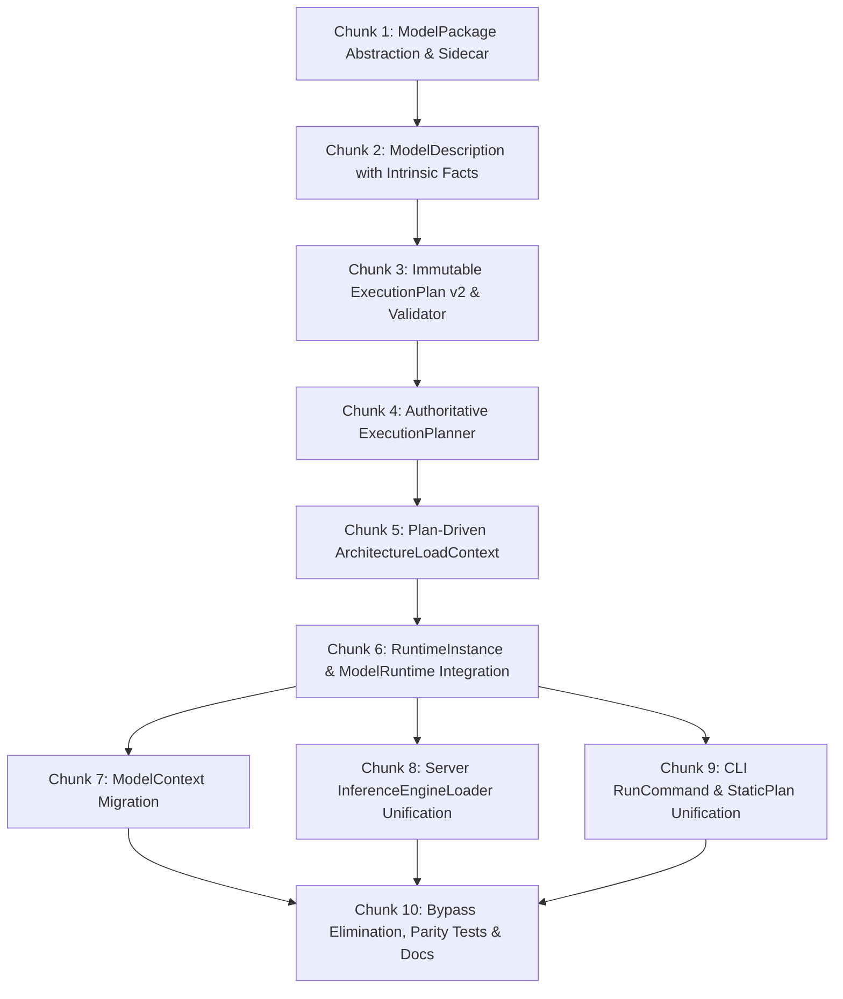

# ExecutionPlan Runtime Architecture — Completed Chunks & Acceptance Evidence

> **COMPLETED 2026-10-07.** Split verbatim out of [../3-product-and-runtime/2026-10-06-execution-plan-runtime-architecture-plan.md](../3-product-and-runtime/2026-10-06-execution-plan-runtime-architecture-plan.md).
> All 10 implementation chunks, 25 acceptance criteria, and closure enforcement contracts were completed and verified on 2026-10-07.

---

## 5. Work Breakdown Structure (10 Manageable Chunks)



### Chunk 1: `ModelPackage` Abstraction & Sidecar Metadata
* **Goal:** Establish the logical component boundary and package representations under `src/OpenTail.Stingray.Engine/Packages/`.
* **Deliverables:**
  * `IModelPackage` interface with `ModelPackageIdentity Identity { get; }`, `string PrimaryPath { get; }`, and component enumeration.
  * `ModelPackageIdentity(string? ContentDigest, ModelFormat Format, ImmutableArray<ModelPackageComponentIdentity> Components)`.
  * Concrete adapters:
    * `LooseGgufModelPackage`: Single GGUF or GGUF + mmproj / draft model.
    * `SafeTensorsModelPackage`: Directory with tensors, tokenizer, and config.
    * `OllamaModelPackage`: Content-addressed blobs referenced by manifest.
  * `StingraySidecarMetadata`: Record for `stingray.json` containing `schema_version`, `model_digest`, `verification_profile_version`, `architecture`, `semantic_family`, `state_model`, `admission`, and `verified_capabilities`. Advisory only; never grants admission.
  * Unit tests validating package component resolution, path-independent identity equality, and sidecar serialization.

### Chunk 2: `ModelDescription` with Intrinsic Planning Facts
* **Goal:** Extract semantic model identity and the complete immutable planning facts snapshot under `src/OpenTail.Stingray.Engine/Planning/ModelDescription.cs`.
* **Deliverables:**
  * `ModelDescription(ModelPackageIdentity Identity, ModelSemanticDescription Semantics, ModelCapabilitySummary Capabilities, ModelResourceSummary Resources, ModelPlanningFacts PlanningFacts)`.
  * `ModelPlanningFacts`: Immutable snapshot containing all facts needed by `TierPlanner` and `ForwardPassSelection` without reopening disk files (layer count, context limit, head dimensions, KV head count, Rope theta/scale, GDN/SSM flags, MLA tensor flags, MoE routing properties, primary weight quantization type).
  * Factory method: `ModelDescription.FromPackage(IModelPackage package)`.
    * `FromPackage` may perform the one-time package/model inspection required to construct `ModelDescription`, including reading metadata/tensor descriptors, but `ExecutionPlanner` must consume the resulting snapshot and must not reopen the package/model files.
  * Unit tests validating that `ModelDescription` completely satisfies `ForwardPassRequest` requirements without disk re-reading.

### Chunk 3: `ExecutionPlan` Schema v2 & Structural Validation
* **Goal:** Refactor `ExecutionPlan.cs` into schema version 2 with strongly typed sub-plans, genuine collection immutability, and NativeAOT source-generated JSON.
* **Deliverables:**
  * Refactored `ExecutionPlan` referencing `ModelPackageIdentity PackageIdentity`, strongly typed `ForwardPassKind ForwardPassKind`, `BackendPlan BackendPlan`, `PlacementPlan Placement`, `StatePlan State`, `BatchingPlan Batching`, `SpeculationPlan Speculation`, `ModalityPlan Modality`, `MemoryPlan Memory`, and `PlanProvenance Provenance`.
  * All internal collections (`Decisions`, `Warnings`, `Components`) use `ImmutableArray<T>` or defensive copies.
  * Retain backward-compatible property accessors (`ModelPath`, `Backend`, `GpuLayers`, `ContextSize`, etc.).
  * `ExecutionPlanValidator`:
    * Enforces strongly typed invariants: `Backend != "auto"`, `GpuLayers >= 0`, `CpuLayers >= 0`, `ContextSize > 0`.
    * Enforces cross-field semantic invariants (e.g. Vulkan passes require Vulkan backend; batching mode matches pass capabilities).
  * Extend `ExecutionPlanJsonContext` for all sub-plans.

### Chunk 4: Authoritative `ExecutionPlanner`
* **Goal:** Centralize all runtime policy orchestration in `ExecutionPlanner.cs`.
* **Deliverables:**
  * `ExecutionRequest`: Complete record capturing all execution-affecting inputs (backend, layer pins, context size, KV dtype, TurboQuant settings, FlashAttention, Rope overrides, thread counts, batch settings, speculation settings, modality modes).
  * `ExecutionPlanner.Plan(ModelDescription model, ExecutionRequest request, BackendCapabilities capabilities)`:
    * Coordinates candidate evaluation (model-aware backend resolution, avoiding unsupported combinations).
    * Invokes `TierPlanner.Plan(...)` and `ForwardPassSelection.SelectPass(...)` internally.
    * Eliminates frontend-specific execution policy (`ForwardPassFrontend.Cli` vs `Server`).
    * Produces and validates an immutable `ExecutionPlan`.
  * Turn `ExecutionPlanBuilder.Build(...)` into a compatibility facade forwarding to `ExecutionPlanner`.

### Chunk 5: Plan-Driven `ArchitectureLoadContext`
* **Goal:** Connect architecture factories directly to the resolved plan.
* **Deliverables:**
  * Add `public required ExecutionPlan Plan { get; init; }` to `ArchitectureLoadContext`.
  * Derive existing context properties (`Decision`, `Backend`, `GpuLayers`, `Placement`) directly from `Plan`.
  * In `CommonForwardPassFactory`, branch directly on `ctx.Plan.ForwardPassKind`.
  * Preserve `ArchitectureDescriptor.ConstructForwardPass(context)` as the single factory seam (`ApplyLoadSetup` $\rightarrow$ `CreateForwardPass`).

### Chunk 6: `RuntimeInstance` Resource Boundary (Integrated with Server `ModelRuntime`)
* **Goal:** Implement the deterministic runtime resource allocator and engine construction boundary in `Engine` and integrate with `ModelRuntime` in `Server`.
* **Deliverables:**
  * `RuntimeInstance.Create(ExecutionPlan plan, Model model)` in `src/OpenTail.Stingray.Engine/Runtime/`:
    * Validates model architecture, format, and package digest against `plan.PackageIdentity`.
    * Verifies that the planned backend is operational; throws `PlanNotExecutableException` on mismatch or unavailability (zero silent fallbacks).
    * Never reads execution policy from `Model.Parameters`.
    * Allocates required backend instances (`CudaBackend`, `VulkanBackend`, `CpuBackend`).
    * Builds `ArchitectureLoadContext` and calls `descriptor.ConstructForwardPass(loadCtx)`.
    * Instantiates `ContinuousBatchingEngine` if `plan.Batching.Mode == BatchingMode.Continuous`, else `InferenceEngine`.
    * Exposes effective `ExecutionPlan` for test and telemetry inspection.
  * Integrate RuntimeInstance with the existing ModelRuntime architecture:
    * RuntimeInstance lives in the Engine/runtime layer and owns the concrete resources required by one ExecutionPlan.
    * ModelRuntime remains in OpenTail.Stingray.Server and owns residency/lifetime around that runtime.
    * ModelRuntimeManager continues to own acquisition, eviction, resource admission and disposal.
    * Do not move ModelRuntime/ModelRuntimeManager into Engine merely to satisfy the conceptual diagram.
    * Architecture hierarchy:
      ```
      ModelRuntimeManager
          │
          ▼
      ModelRuntime
          │
          ├── Model / ModelPackage
          ├── ExecutionPlan
          └── RuntimeInstance
                 ├── backend resources
                 ├── forward pass
                 └── inference engine
      ```

### Chunk 7: Migrate `ModelContext`
* **Goal:** Replace `BuildForwardPass(...)` policy rediscovery in `ModelContext`.
* **Deliverables:**
  * Expose `public ExecutionPlan ExecutionPlan { get; }` on `ModelContext`.
  * Ensure `ModelContext` owns the plan for the runtime it represents.
  * Refactor `CreateDefaultEngine()` and `CreateContinuousBatchingEngine(maxBatchSize)` to request a plan with the corresponding `BatchingMode` and instantiate via `RuntimeInstance.Create(plan, _model)`.
  * Eliminate the 300-line private backend/selection switch in `ModelContext`.

### Chunk 8: Migrate Server (`InferenceEngineLoader`)
* **Goal:** Ensure `LoadFromPlan()` never rediscovers policy.
* **Deliverables:**
  * Update `LoadFromPlan(plan)`:
    * Validate package identity.
    * Call `RuntimeInstance.Create(plan, model)`.
    * **No `baseOptions` override; never call `Load(options)`.**
  * Update `Load(options)`:
    * Map options to `ExecutionRequest`.
    * Call `ExecutionPlanner.Default.Plan(...)`.
    * Call `RuntimeInstance.Create(plan, model)`.

### Chunk 9: Migrate CLI (`RunCommand` and `StaticPlanCommand`)
* **Goal:** Unify all CLI execution paths onto `ExecutionPlanner` and `RuntimeInstance`.
* **Deliverables:**
  * In `RunCommand.cs`: map CLI arguments to `ExecutionRequest`, invoke `ExecutionPlanner`, and execute via `RuntimeInstance`.
  * `--explain` prints the exact `ExecutionPlan` being executed.
  * In `StaticPlanCommand.cs`: invoke `ExecutionPlanner` directly.

### Chunk 10: Bypass Elimination, Contract Tests & Parity Verification [COMPLETED]
* **Goal:** Eliminate dead policy code and prove cross-frontend consistency.
* **Deliverables:**
  * Audit codebase: no calls to `ForwardPassSelection.SelectPass()` or `TierPlanner.Plan()` outside `ExecutionPlanner` and tests.
  * `ExecutionPlannerTests`: Verify deterministic mapping of requests to concrete plans; verify candidate rejection during auto planning.
  * `ExecutionPlanRuntimeTests`: Prove runtime executes the exact planned forward pass and placement without re-planning; verify `RuntimeInstance.ExecutionPlan == plan`.
  * `PlanNotExecutableTests`: Verify explicit failure when hardware cannot satisfy the plan.
  * Cross-Frontend Parity Tests: Verify that CLI, Server, and `ModelContext` produce identical plans for identical inputs (`tests/OpenTail.Stingray.Tests.Core/FrontendPlanParityTests.cs`).
  * Updated architecture documentation in `docs/3-product-and-runtime/`.

---

## 6. Acceptance Criteria Checklist

- [x] `ModelPackage` is a logical abstraction over external model components.
- [x] `ModelPackageIdentity` does not contain file paths in its record equality.
- [x] When digests are available, identical packages at different paths produce identical `ModelPackageIdentity`; without digests, identity is explicitly provisional.
- [x] No new competing Stingray physical model/blob format is introduced.
- [x] Ollama-compatible model packages can be consumed without Ollama installed/running.
- [x] Ollama/package blobs can be reused without unnecessary duplicate weight copies.
- [x] Stingray-specific metadata is represented separately from package storage (`stingray.json` sidecar).
- [x] Stingray sidecar metadata is keyed to model/package identity and is advisory only (never overrides admission).
- [x] `ModelDescription` contains an immutable snapshot of all intrinsic planning facts.
- [x] `ModelDescription.FromPackage` performs the one-time inspection; `ExecutionPlanner` never reopens model files.
- [x] `ExecutionRequest` carries every execution-affecting option (backend, device, layers, context, KV dtype/store, TurboQuant, batching/sessions, speculation switches, DSpark path/placement/required, MoE expert execution, prefill/prefix/hybrid-handoff, SnapKV). Inherited `STINGRAY_*` variables enter ONLY through `ExecutionRequestEnvironment.ApplyTo` at the frontend. `NoGpuProbe` is a capability-probe input consumed by frontends, not planner policy.

- [x] `ExecutionPlan` is genuinely immutable (`ImmutableArray<T>`) and contains concrete choices (no `"auto"`).
- [x] `ExecutionPlan` validation checks strongly typed invariants without overly restrictive universal equations.
- [x] Candidate evaluation during planning is model-aware and distinct from runtime fallback.
- [x] `RuntimeInstance` executes the plan strictly without re-planning or reading `Model.Parameters`. Contract-tested: `RuntimeLayer_DoesNotMakePolicyDecisions` forbids `TierPlanner.Plan`, `DSparkPlacementPlanner.Plan` and `ForwardPassSelection.Select` in `RuntimeInstance.cs` and `InferenceEngineLoader.cs`.
- [x] `RuntimeInstance` (Engine) integrates cleanly with `ModelRuntime` and `ModelRuntimeManager` (Server).
- [x] `RuntimeInstance` exposes the effective `ExecutionPlan` for inspection and contract verification.
- [x] Existing `ForwardPassSelection` and `TierPlanner` policy is orchestrated by `ExecutionPlanner`, not rewritten.
- [x] Frontend-specific execution policy is eliminated: `ForwardPassFrontend` no longer exists. The Cli branches (the policy the planner already ran for every frontend) became the single policy; Server-only branches were deleted. Refusal wording is now the CLI wording for all frontends. Server-only capability checks that are not policy (Gemma-4-only image input, DSpark tap support) stay as execution validation in `LoadFromPlan`.
- [x] CLI, Server, and `ModelContext` all converge on the same planning path.
- [x] `LoadFromPlan()` does not accept execution-altering options and never calls `Load()`.
- [x] The runtime cannot silently substitute CPU/Vulkan/CUDA for the backend in the plan.
- [x] Plan JSON serializes/deserializes using NativeAOT source generation.
- [x] Parity tests confirm identical plans across all frontends.
- [x] No model weights are bundled into Stingray itself.

---

## 7. Implementation Summary

The unified execution plan architecture has been implemented across all 10 chunks:
1. **Packaging**: `ModelPackageIdentity` and `IModelPackage` implementations (`LooseGgufModelPackage`, `SafeTensorsModelPackage`, `OllamaModelPackage`) with advisory `StingraySidecarMetadata`.
2. **Planning Facts**: `ModelDescription` captures all intrinsic properties in a single pass without disk re-reading.
3. **Execution Contract**: Schema v2 `ExecutionPlan` with immutable collections, strongly typed sub-plans (`BackendPlan`, `PlacementPlan`, `StatePlan`, `BatchingPlan`, `SpeculationPlan`, `ModalityPlan`, `MemoryPlan`, `PlanProvenance`), and zero `"auto"` options.
4. **Central Planner**: `ExecutionPlanner.Plan(desc, request, capabilities)` coordinates candidate evaluation, tier placement, and forward pass selection without frontend-specific divergence.
5. **Context Propagation**: `ArchitectureLoadContext` directly carries the authoritative `ExecutionPlan`.
6. **Resource Ownership**: `RuntimeInstance.Create(plan, model)` deterministically allocates backends and forward passes, throwing `PlanNotExecutableException` on hardware or contract mismatch with zero silent fallbacks.
7. **ModelContext**: Plan-driven engine construction via `RuntimeInstance.Create(plan, _model)`.
8. **Server Loader**: `InferenceEngineLoader.LoadFromPlan(plan, opts)` directly instantiates `RuntimeInstance.Create(plan, model)` without re-evaluating policy.
9. **CLI Engine**: `RunCommand` and `StaticPlanCommand` resolve via `ExecutionPlanner` and execute via `RuntimeInstance`.
10. **Parity & Audit**: Cross-frontend parity verified in `FrontendPlanParityTests.cs`, ensuring identical plans and contracts across `ModelContext`, `InferenceEngineLoader`, and CLI `ExecutionPlanBuilder`.

---

## Closure pass 2026-10-07 — what the repository actually enforces

**Principle now true in code:** policy = `ExecutionPlan`; resources = `RuntimeInstance`. Every plan-derived execution setting reaches a runtime object as an *instance-local constructor argument*; nothing is written to the process environment to reach it.

### Instance-local settings seam

```
ExecutionRequest ──ExecutionPlanner──▶ ExecutionPlan { Moe, Tuning{Kv,Speculation,Prefill,SnapKv}, Speculation(DSpark), BackendPlan.DeviceIndex … }
        ▲                                         │
ExecutionRequestEnvironment.ApplyTo               ▼
(frontends only; env → request)         RuntimeInstance ─▶ EngineSettings ─▶ ArchitectureLoadContext.Settings
                                                                    └─▶ every ForwardPass / InferenceEngine / MtpDecoder / ExpertSlotManager / PagedKvCache constructor
```

* `EngineSettings` (immutable, one per runtime instance) = `EngineTuning` (KV store/dtype/auto-narrow threshold, speculation switches, prefill/prefix/handoff, SnapKV) + `MoePlan`.
* `PagedKvCache` no longer has static env-backed members; BF16 rounding, store mode and auto-narrow threshold are constructor arguments (the failure documented in its remarks — a global default reaching a pass with no BF16 reader — can no longer happen).
* `WarmPinConfig` is pure functions of an instance’s `MoePlan`; `ExpertSlotManager`/`CudaExpertSlotManager` take it. The static `MtpDecoder._mtpMinAccept`, `CudaHybridGdnForwardPass.BatchedMoeVerifyEnabled`, handoff `static readonly` settings and the `ResolveDraftN/VerifyLen/MinConfidence/MtpBatchMax` env fallbacks are instance/plan values.
* Code that constructs a pass directly (tests, benchmarks, embedding) gets `EngineSettings.FromEnvironment()`: today’s inherited values, snapshotted once at construction. The plan-driven path never uses it.
* `RuntimeInstance.Create` no longer calls `Environment.SetEnvironmentVariable` for anything except the CUDA device pin below.

### DSpark
Placement is decided once in `ExecutionPlanner.ResolveSpeculation` (including the Gpu→Cpu re-plan). The planner no longer reads `STINGRAY_DSPARK_PLACE` (the request bridge supplies it). `ExecutionRequest.DSparkRequired` makes “Off” deterministic and frontend-independent: required ⇒ planning throws `NotSupportedException`; optional ⇒ the plan records `DSparkEnabled=false` plus a warning and execution continues normally. The server sets `Required=true`; the CLI default is optional. `AttachDSpark` / the CLI runner only obey the plan.

### Device selection
`ExecutionRequest.DeviceIndex` → `BackendPlan.DeviceIndex` → `new VulkanBackend(index)` (Vulkan runtimes are fully isolated). **CUDA limitation (not a fake guarantee):** the device is pinned through `CUDA_VISIBLE_DEVICES`, read once at driver init. The pin runs before the capability probe and again in `RuntimeInstance`; a process that already pinned device *N* refuses a plan for device *M* with `PlanNotExecutableException` instead of silently using *N*. One process ⇒ one CUDA device. If the operator sets `CUDA_VISIBLE_DEVICES` themselves, indices are relative to that set and are not rewritten. Not exercised on real hardware (no CUDA / second GPU here).

### Ownership (single owner, explicit)
`InferenceEngine` frees its forward pass and then its `owned` list (newest first, each once, never the pass itself — it was previously in both). For batching engines `RuntimeInstance.Dispose` frees the pass and then each backend once (honouring `DrainedOnDispose`); the server’s `OwnedDisposableEngine` delegates to the instance. The DSpark draft is owned by `InferenceEngine`. The Gemma-4 vision projector/embedder handed to `EnableImageInput` keeps its pre-existing lifetime (not changed here).

### Remaining process-global state (honest list)
* **`SimdKernels.CpuThreads` / `MinBatchForBlas`:** `RuntimeInstance` writes `SimdKernels.CpuThreads` from `BackendPlan.ThreadCount` and the CLI/server write `MinBatchForBlas`. The CPU kernel pool is process-wide by design, so two instances with different thread counts share the last-written value. This changes parallelism, not selected math, but it **is** cross-instance state.
* **CUDA device** (above).
* **Developer kernel/diagnostic gates** still read from the environment inside the engine (same math, different kernel/path, or tracing): `STINGRAY_TRACE_*`, `_PROFILE_*`, `_PROBE_*`, `_Q4K_/_Q6K_/_Q80_ SOA/DP4A/MMQ`, `_PREFILL_FLASH*/_PREFILL_GEMM/_PREFILL_MMQ/_PREFILL_ATTN_*`, `_VULKAN_*`, `_CUDA_GRAPH`, `_DECODE_*`, `_BATCHED_*`/`_MOE_BATCHED_PREFILL`, `_MOE_GPU_ROUTER`, `_MOE_GPU_PREFILL_MIN_TOKENS`, `_MOE_PIN_MODE`, `_MOE_THREADS`, `_MOE_SLOTS` (test override), `_PREFILL_DEQUANT_MB`, `_CPU_POOL*`, `_CPU_SPIN`, `_PREFAULT`, `CUDA_MODULE_LOADING`. Not captured in the plan; they are process-level developer overrides. A test that flips one of these mid-process affects every instance.
* Static *counters* (`PagedKvCache.Bf16Conversions`, rounded-append counters) are diagnostics.
* `StaticPlanCommand` still calls `TierPlanner` for its read-only report (not execution).

### Enforcement
`RuntimeCode_DoesNotReadOrWritePolicyEnvironment` scans `src/OpenTail.Stingray.Engine` for every plan-carried variable (outside `EngineEnvironment`, `SnapKvConfig.FromEnvironment`, `GpuDeviceSelection`) and fails on any hit; `RuntimeLayer_DoesNotMakePolicyDecisions` forbids the policy planners in `RuntimeInstance`/`InferenceEngineLoader`. Isolation tests (`InstanceLocalSettingsTests`, `WarmPinConfigTests`) build two differently-configured instances in one process and assert neither affects the other. A full two-model, real-weight isolation run was **not** performed (no loadable synthetic fixture; real weights absent).
