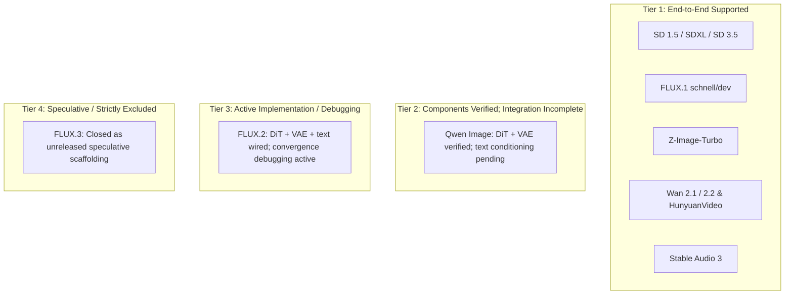

# Architecture Card: Diffusion & Generative Media Pipelines

> **Namespace:** `OpenTail.Stingray.Diffusion`  
> **Verification Status:** Categorized by verification tier (see Section 1 and [docs/STATUS.md](../STATUS.md))  
> **Supported Modalities:** Text-to-Image, Image-to-Image, Text-to-Video, Acoustic Diffusion  
> **Key Implementations:** `DiffusionPipeline.cs`, `EulerFlowScheduler.cs`, `VaeDecoder.cs`, `WanPipeline.cs`

---

## 1. Pipeline Verification Tiers

To prevent misleading claims, diffusion architectures are strictly classified according to their current verification status:



### Tier 1: End-to-End Supported
The complete user-facing generation pipeline has passed verification and produces valid image/video/audio output:
- **Stable Diffusion 1.5 & SDXL:** Classic latent diffusion with CLIP ViT text conditioning and optional ControlNet conditioning.
- **Stable Diffusion 3 / 3.5:** Multimodal Diffusion Transformer (MMDiT) with separate text and image attention paths.
- **FLUX.1 (schnell & dev):** 12B parameter rectified-flow DiT with joint text-image attention and Rotary Position Embeddings.
- **Z-Image-Turbo:** Ultra-fast distilled diffusion capable of high-fidelity 512×512 synthesis in 4 steps.
- **Wan 2.1 / 2.2 Video:** 3D spatio-temporal DiT generating short video sequences and animated GIFs.
- **HunyuanVideo & LTX-Video:** High-resolution video generation pipelines.
- **Stable Audio 3:** Variable-length 44.1 kHz stereo audio generation via continuous MMDiT.

### Tier 2: Components Verified; Integration Incomplete
- **Qwen Image:** Both the DiT forward pass (remedying 4 bugs) and the VAE decoder (reusing `WanVaeDecoder3D`) are verified against real weights. Full end-to-end support remains pending the final wiring of real LLM text conditioning (see [`docs/STATUS.md`](../STATUS.md#L191)).

### Tier 3: Active Implementation / Convergence Debugging
- **FLUX.2:** Complete weight-loading and forward-pass wiring landed for all three core components (DiT, Mistral-based text conditioning taps, and VAE unshuffle). End-to-end generation is wired and produces finite outputs; actively undergoing image convergence debugging to resolve periodic tiling artifacts before claiming production support.

### Tier 4: Speculative Scaffolding (Strictly Excluded)
- **FLUX.3:** Closed per `docs/STATUS.md` and `docs/088`. Code represented speculative scaffolding not corresponding to any released model. Strictly excluded from all public documentation.

---

## 2. Engine Mechanics & Schedulers

### Rectified Flow Matching
Modern diffusion pipelines in Stingray (FLUX.1, SD 3.5, Wan) utilize flow matching rather than traditional DDPM/DDIM Gaussian diffusion:
- Latents transition linearly between pure Gaussian noise $x_1$ and data latents $x_0$ along a continuous vector field: $x_t = (1 - t) x_0 + t x_1$.
- `EulerFlowScheduler` integrates the predicted velocity vectors with resolution-dependent timestep shifts:
  $$\frac{dx_t}{dt} = v_\theta(x_t, t, c)$$

### VAE Decoding & Memory Safety
- Full uncompressed latents are decoded via `VaeDecoder.cs` into 8-bit RGB channels.
- For high-resolution images, tiled VAE decoding breaks latents into overlapping spatial tiles, preventing out-of-memory errors on systems with limited RAM.

---

## 3. Practical Usage & Commands

### CLI Image Generation (Z-Image-Turbo)
```bash
stingray image \
  -m models/z_image_turbo-Q5_K_M.gguf \
  --vae models/z-image-turbo/vae \
  --qwen-encoder models/Z-Image-AbliteratedV1.Q5_K_M.gguf \
  --qwen-tokenizer models/z-image-turbo/tokenizer/tokenizer.json \
  -p "a dramatic alpine peak at sunset, volumetric lighting" \
  -W 512 -H 512 --steps 4 -o alpine.png
```

### Video Generation (Wan 2.1)
```bash
stingray image \
  -m models/wan2.1-t2v-1.3B-Q4_K_M.gguf \
  -p "ocean waves crashing against rocks in slow motion" \
  --video-frames 16 \
  -o waves.gif
```

### Public C# API

For a complete, runnable console application demonstrating image generation with step-by-step progress callbacks, see the [Diffusion Sample (`samples/OpenTail.Stingray.Sample.Diffusion`)](../../samples/OpenTail.Stingray.Sample.Diffusion/).

```csharp
using OpenTail.Stingray.Diffusion;
using OpenTail.Stingray.Diffusion.StableDiffusion;

// 1. Resolve compute backend (Vulkan GPU or managed SIMD CPU)
var (backend, ownsBackend) = DiffusionBackendResolver.Resolve(explicitBackend: null);

// 2. Load the pipeline from a single checkpoint
using IDiffusionPipeline pipeline = StableDiffusionPipeline.Load("v1-5-pruned-emaonly.safetensors", backend: backend);

// 3. Generate image from prompt
pipeline.Generate(new ImageGenerationRequest
{
    Prompt = "A serene alpine mountain lake at sunrise, highly detailed digital art",
    Width = 512,
    Height = 512,
    Steps = 20,
    Guidance = 7.5f,
    OutputPath = "output.png",
    Progress = (step, total) => Console.Write($"\rStep {step}/{total}...")
});
```

---

## 4. Hardware Recommendations & Performance

Diffusion and video pipelines are compute-intensive. While pure CPU execution is supported, GPU acceleration via Vulkan or CUDA is strongly recommended for production use:

Supported backends per model are in the [STATUS matrix](../STATUS.md). Times below were measured on a 5700G integrated GPU (shared memory), so a discrete GPU will be much faster. The Wan row is an older CPU figure, and the 2026-10-10 single-frame 256×256/20-step Vulkan run took 100 s.

| Model | Resolution | Steps | Hardware | Wall-Clock Generation Time | Hugging Face Repository |
|---|---|---|---|---|---|
| **Z-Image-Turbo** | 512×512 | 4 | Vulkan (5700G iGPU) | 129 s (2026-10-10) | [Tongyi-MAI/Z-Image-Turbo](https://huggingface.co/Tongyi-MAI/Z-Image-Turbo) |
| **FLUX.1-schnell** | 512×512 | 4 | Vulkan (5700G iGPU) | 158 s (2026-10-10) | [black-forest-labs/FLUX.1-schnell](https://huggingface.co/black-forest-labs/FLUX.1-schnell) |
| **SD 1.5** | 512×512 | 20 | Vulkan (5700G iGPU) | 162 s (2026-10-10) | [stable-diffusion-v1-5/stable-diffusion-v1-5](https://huggingface.co/stable-diffusion-v1-5/stable-diffusion-v1-5) |
| **Wan 2.1 (1.3B)** | 256×256 | 16 frames | CPU (AVX2) | ~6.1 minutes | [Wan-AI/Wan2.1-T2V-1.3B](https://huggingface.co/Wan-AI/Wan2.1-T2V-1.3B) |
